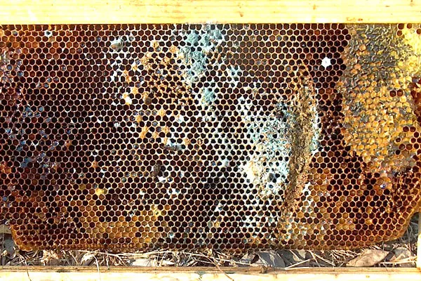

Some beehives have poor ventilation. Bees during winter die because of this [❄️ Overwintering collapse](❄️%20Overwintering%20collapse.md)

Basically its not the -30 degrees that kills the bees, its the humidity that gets accumulated in the hive that makes it hard for them to warm themselves.

Bad ventilation typically happens because

- hive does not have an exit / hole way **on top of the hive**
- top frames have plastic cover that does not allow for any air to go through

Bad ventilation in turn causes mold/fungi to appear, which is bad for bee health

source - [https://www.honeybeesuite.com/physics-for-beekeepers-mold-in-a-beehive/](https://www.honeybeesuite.com/physics-for-beekeepers-mold-in-a-beehive/)