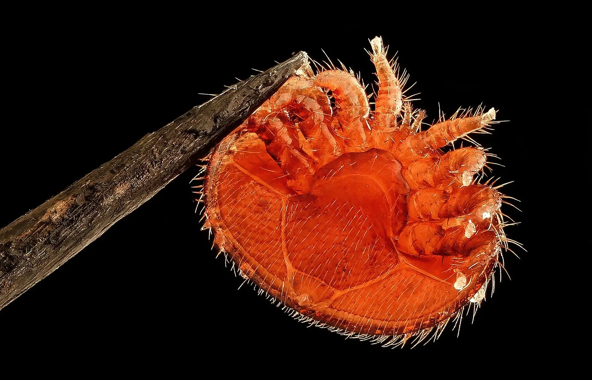

# Problems we are solving

> 💡 Hard, frequent, unscalable work to keep bees healthy for precise pollination and food security

Bees are key species for our food security. Farmers are cooperating with beekeepers to combat [🌻 Precise pollination](🌻%20Precise%20pollination.md) and increase yields  
   
But traditional beekeeping requires [👁️ Observability of bee colony](👁️%20Observability%20of%20bee%20colony.md), because bees can experience [🍽️ Bee colony starvation](🍽️%20Bee%20colony%20starvation.md) , [💀 Colony without a queen](💀%20Colony%20without%20a%20queen.md), [🧶 Swarming](🧶%20Swarming.md), [🦀 Infestations](🦀%20Infestations.md) and [🦀 Diseases](🦀%20Diseases.md) which weaken the colony and cause [❄️ Overwintering collapse](❄️%20Overwintering%20collapse.md).  

Observability is typically solved with a [💪🏻 Physical labor](💪🏻%20Physical%20labor.md) and [👁️ Time-consuming inspections](👁️%20Time-consuming%20inspections.md). Dressed in a protective suit, in the summer heat, every week, you need to lift 20 kg beehive sections designed 150 years ago and notice small details while you are getting stung by defending bees, [💀 Intrusive inspections](💀%20Intrusive%20inspections.md). 

As your apiary grows, this becomes [💪🏻 Unscalable work](💪🏻%20Unscalable%20work.md). [👨🏻‍🚒 Industrial beekeepers](../clients/👨🏻‍🚒%20Industrial%20beekeepers.md) have [🏘️ Multiple apiaries](🏘️%20Multiple%20apiaries.md) at [🌲 Distant locations](🌲%20Distant%20locations.md) that are hard to reach. Existing solutions do not adequately solve these issues

#### Problems and goals

<!-- QueryToSerialize: table WITHOUT ID "[" + default(title, file.name) + "]" + default( "("+  replace(replace(file.path, "gratheon.com/", ""), " ", "%20") + ")", "") as issue, class, priority FROM "gratheon.com/about/Problems" WHERE file.name != "index" SORT priority desc -->
<!-- SerializedQuery: table WITHOUT ID "[" + default(title, file.name) + "]" + default( "("+  replace(replace(file.path, "gratheon.com/", ""), " ", "%20") + ")", "") as issue, class, priority FROM "gratheon.com/about/Problems" WHERE file.name != "index" SORT priority desc -->

| issue | class | priority |
| ----- | ----- | -------- |
<!-- SerializedQuery END -->

Survey by BeeSage, source - [https://beesage.co/en/blog/what-is-the-hardest-thing-about-beekeeping](https://beesage.co/en/blog/what-is-the-hardest-thing-about-beekeeping)

## On “saving the bees”

We are not focusing solely on saving honeybees as a species, because globally colony numbers are increasing. Ecosystems are complex. We support diversity of plants and wild pollinators.

[https://www.youtube.com/watch?v=CidaOP7PA-o](https://www.youtube.com/watch?v=CidaOP7PA-o)

<iframe width="100%" height="400" src="https://www.youtube.com/embed/VSYgDssQUtA" title="Bee extinction: Why we&#39;re saving the wrong bees" frameborder="0" allow="accelerometer; autoplay; clipboard-write; encrypted-media; gyroscope; picture-in-picture; web-share" referrerpolicy="strict-origin-when-cross-origin" allowfullscreen></iframe>

> Note that we use a database for problems in order to link problems with features that will help solving or mitigating them. Beekeeping has a lot of problems. We prioritise some of them to have more focused solution