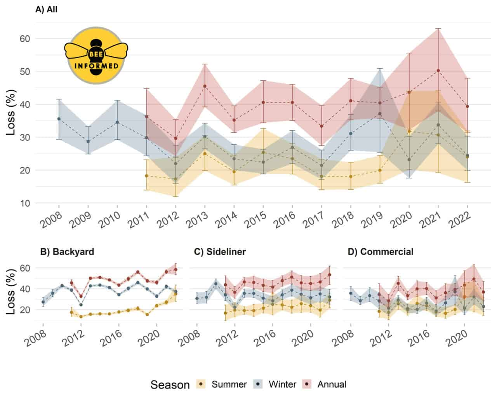
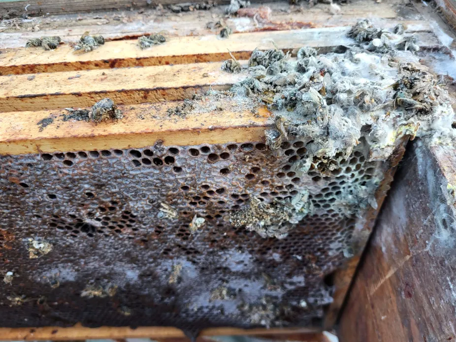
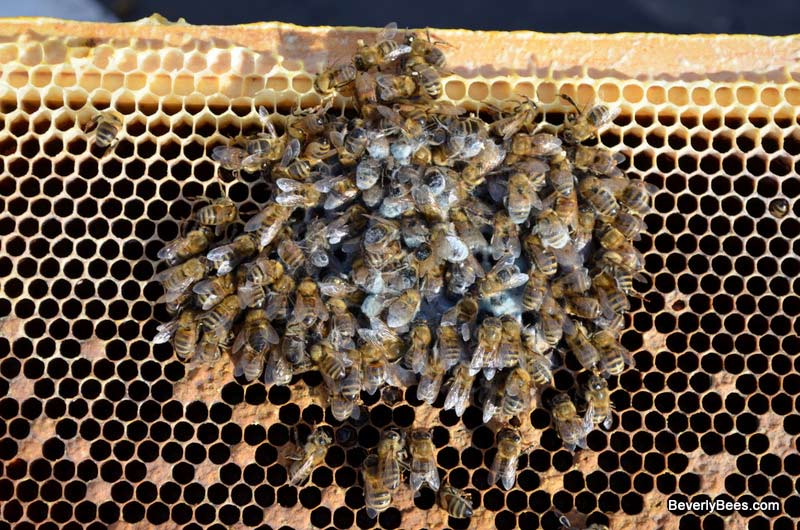

Bees can die over the winter if they are too weak as they cannot warm themselves and its brood

Colony loss. BeeInformed [https://beeinformed.org/2022/07/27/united-states-honey-bee-colony-losses-2021-2022-preliminary-results-from-the-bee-informed-partnership/](https://beeinformed.org/2022/07/27/united-states-honey-bee-colony-losses-2021-2022-preliminary-results-from-the-bee-informed-partnership/)

Collapsed bee colony affects also bee frames, making honey no longer digestable, polluting frames and the hive with fungi, viral and bacterial infections

Collapsed bee colony, [source](https://www.facebook.com/groups/108065015894483/posts/1829571640410470/?__cft__[0]=AZXwZvGy1WEEkQuDwGfjX4k9CE7eb86wDL1aCMzz96SW58lgmtwqtzGenTBu7miHeGvJP6Egabdoz9NSqrFXOI0t5wcCBmD7d3ZsvI12BX59UPuxbVzCWM4dWbC3ZSz6urCA0lnLucylumh8oMOD1P4hpoBi_uEf4nwXJCj24ge5X8EuQ68D0dOkCwBSbA-H9AHaRz1VVIuAp4qR2CcSp2FR&__tn__=%2CO*F)