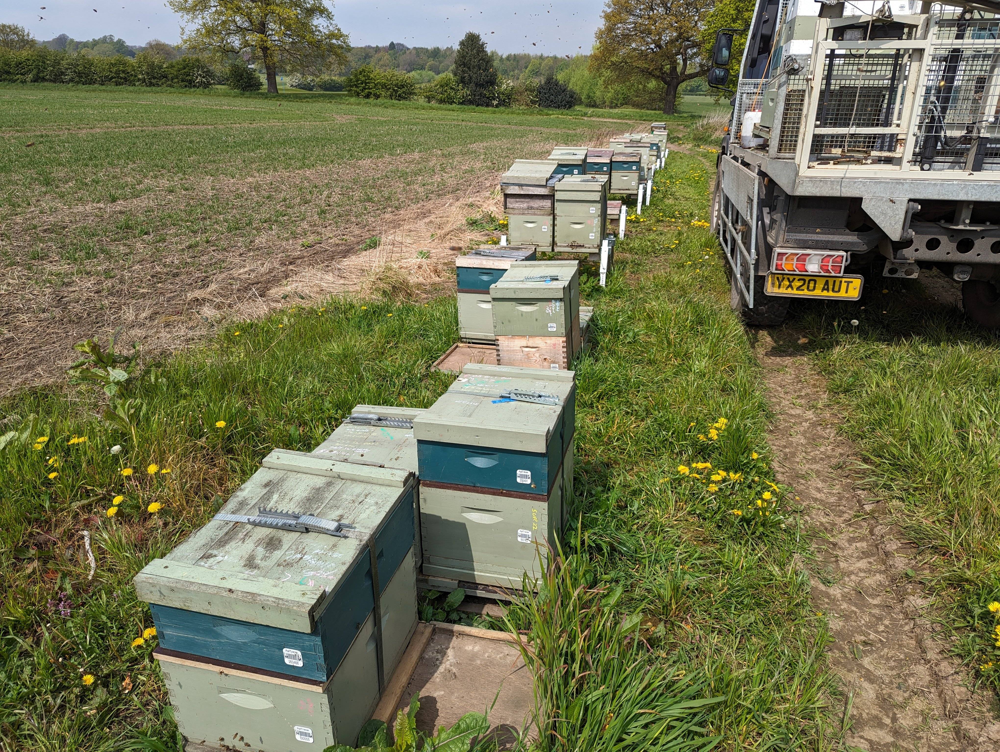

If your apiaries are far away (forest, rural area), you need to drive for inspections.

This is loss of time, fuel, money and adds various risks.

source - [https://twitter.com/austincwb/status/1785712653215715354/photo/1](https://twitter.com/austincwb/status/1785712653215715354/photo/1)
