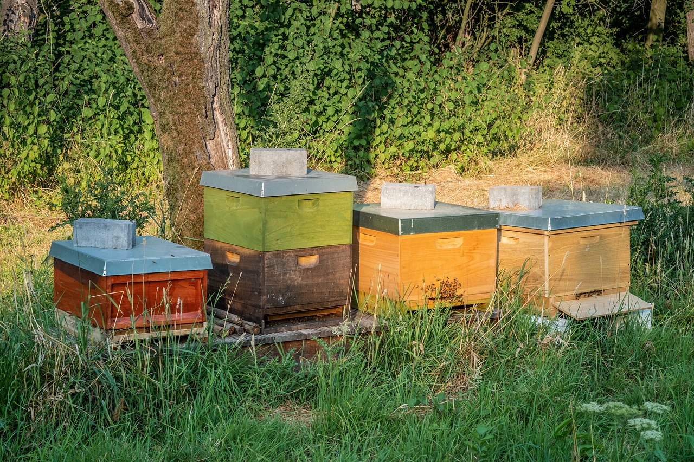

Hard to make **decisions** without **up-to-date** and **correct information** about the **colony development**. Decisions can be about splitting the hive, treating against varroa mites, closing the hive entrance for defence, adding a new queen, adding or removing frames with brood or honey/polle

- Timing. It is easy to miss a problem if your inspection window is too big (1 month). Inspections need to be frequent (< weekly) to detect slight changes and trends
- Attention. Lack of recorded information by the beekeeper during the inspection

## What information is needed

- Demography and its dynamics

Beehives as a black box