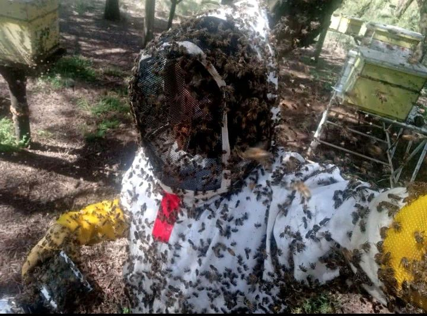

Hard to inspect, can get stings through the suit

[Africanized bees](https://www.linkedin.com/groups/1583887?q=highlightedFeedForGroups&highlightedUpdateUrn=urn%3Ali%3AgroupPost%3A1583887-7135131410780069888&lipi=urn%3Ali%3Apage%3Ad_flagship3_feed%3BeYFRvSSERLuPws4VJUQm%2Fw%3D%3D)

Risks to surrounding people (sensitive neighbours, kids, allergic visitors) limits possible areas of beekeeping (city apiaries, close to roads)

<iframe width="433" height="244" src="https://www.youtube.com/embed/O4ldpyIE5t4" title="Euthanizing of a dangerous hive." frameborder="0" allow="accelerometer; autoplay; clipboard-write; encrypted-media; gyroscope; picture-in-picture; web-share" referrerpolicy="strict-origin-when-cross-origin" allowfullscreen></iframe>

<iframe width="433" height="244" src="https://www.youtube.com/embed/Wk2HlKE1szo" title="If I didn&#39;t have the suit on, I&#39;d be dead." frameborder="0" allow="accelerometer; autoplay; clipboard-write; encrypted-media; gyroscope; picture-in-picture; web-share" referrerpolicy="strict-origin-when-cross-origin" allowfullscreen></iframe>
