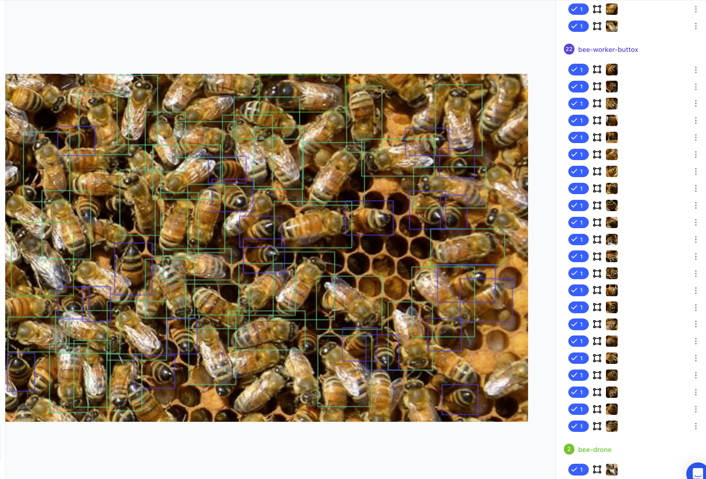
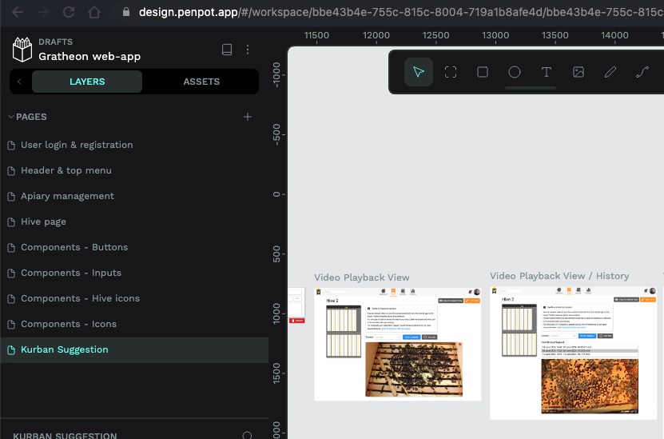

#### Why to volunteer

Volunteering means you work for free, because you’re **motivated** by other things:

- You want to learn and become a beekeeper, believing in [Company mission](../purpose/Company%20mission.md), trying to help [👨🏻‍🚀 Backyard beekeepers](../products/clients/👨🏻‍🚀%20Backyard%20beekeepers.md) and the 🐝 bees
- Gaining open-source proof of experience you can use at applying to other jobs & positions 
  (ex. you are a student and you want to show contribution with CAD model or typescript code)
- Learning something new in the area that you are not yet familiar with 
  (ex. IoT if you are a web developer)
- Having more freedom of trying oneself in different **role**, compared to an established enterprise where entry barrier is so high
  (ex. Trying to be an engineer if you are a PM)
- Teaching others if you are experienced in one area 
  (ex. as Robotics engineer streaming lessons on twitch & youtube)

## How
Before you start, be prepared that in startups like ours, in opposite to large companies, you won't be explicitly told what to do. You pretty much need to find the work yourself of what you feel helps the project (and you) the most. [Adapt to change 🏕️](../company/Culture%20and%20values%20🫀/Adapt%20to%20change%20🏕️.md)

As we are in volunteer mode, its expected that people are contributing with different levels of their `activity`. So if you collaborate with others, do not expect much. People may suddenly disappear due to personal reasons (family, work, study etc). Lower your expectations as lower entry barrier for volunteers. [Humbly kind 🧸](../company/Culture%20and%20values%20🫀/Humbly%20kind%20🧸.md) 

## What to do

You can contribute by following these steps:

1. [**Join our discord**](https://discord.gg/PcbP4uedWj)
2. Pick a feature [Ideas and Features](https://www.notion.so/Ideas-and-Features-ca76f493a1454e14b7dfbae7bd292a2e?pvs=21) if you want to work on a large, full-stack part of the product. A feature requires product thinking and multiple expertises - UX, Frontend, Backend, DB, ML. Its a [**T**eam effort](https://www.notion.so/Team-effort-946788035d7f4462b4228eee8a4ca7ca?pvs=21)
    - In large companies features are maintained by product managers
3. Alternatively, pick a task from [Tasks](https://www.notion.so/Tasks-67cbebc3a13c4fb3b8ac3396b4d03af4?pvs=21) if you want to work on internal, infrastructural task or a feature improvement. Tasks are more specialized.
    - In large companies tasks are managed by a team in JIRA. We don’t use JIRA currently. We tried github issues but those add extra friction.
4. Ask for more information in discord to get attention and document more information for the feature as part of [Features (prioritized and incomplete)](https://www.notion.so/Features-prioritized-and-incomplete-0ccc5a51879941eb8b6f220c261be046?pvs=21)
5. Follow [Engineering onboarding](/docs/web-app/)  if you need to change code and run services locally
6. Think ahead how your contribution will look like. We use different software [Internal tools & cloud services](https://www.notion.so/Internal-tools-cloud-services-2f74cf6da2854e03986c6de7bda3551a?pvs=21) to host results

### Contributions

Because of this, **short and atomic contributions as artifacts** are important both to the community as to the contributor. Contribution adds value to the product ([Gather value 🍯](../company/Culture%20and%20values%20🫀/Gather%20value%20🍯.md)). Contribution must have a permissive license for us to reuse the work.

_Asking_ for information is not a contribution

A weak contribution 
- Reporting a bug (raises awareness)
- Suggesting an idea for a new feature, improvement or change

A strong contribution is:
- design doc, research paper, RFC that describes in-depth solution for product or feature
- a file, image, cad model, design, device shared with us
- documenting or clarifying a feature 
    - recording a youtube video how thing is working
- a github commit that fixes a bug or adds new features
- a new repository, microservice

### Examples of contributions
- A github pull-request to an existing repository or a new repository that we can fork is one way to show your results. Examples - [backend services](https://github.com/Gratheon/telemetry-api/pull/9), [CAD models](https://github.com/Gratheon/hardware-robotic-beehive/pull/3)
- A [penpot](https://github.com/Gratheon/hardware-robotic-beehive/pull/3) draft for UX (ask for invite to get access)
- QA testing session conducted that found various bugs and issues with suggestions how to mitigate them. Results were a mix of google-docs, excel and chat messages reporting specific issues. Use `#product-feedback` discord channel to report issues. Use one message per issue to have separate threads.
- Annotations for training Machine Learning models

## Communication

If Discord is not enough, we also try to have weekly meetings over google meet. Its free form, but we try to record meetings into [All-hands meeting recordings](https://www.notion.so/All-hands-meeting-recordings-405d4ff10fc04cd4a57dc8ed9ef362a9?pvs=21) and stream it to [twitch](https://www.twitch.tv/tot_ra).

- We use Discord (specialized `#layer-*` channels for discussion to resolve blockers) and Notion to link results, knowledge and documentation (although we transition to native markdown nowdays for docs to be available on website too)

### Acknowledgement

If you are a contributor, we try to highlight this.
- you are seen in github repository if you are a contributor
- in discord you will get a 🟡 yellow name if you _contributed_ some code to common namespace
- your name remains in tasks system if you contributed to it

On demand, we can also
- add acknowledgement to linkedin

If you stick around for a long while and do the hard work today, you get a promise to get compensated in the future based on [Equity & fundraising program plan](https://www.notion.so/Equity-fundraising-program-plan-7ded807f758c405c84fc03aa1e3d91b2?pvs=21), as it is in company interest to keep the talent