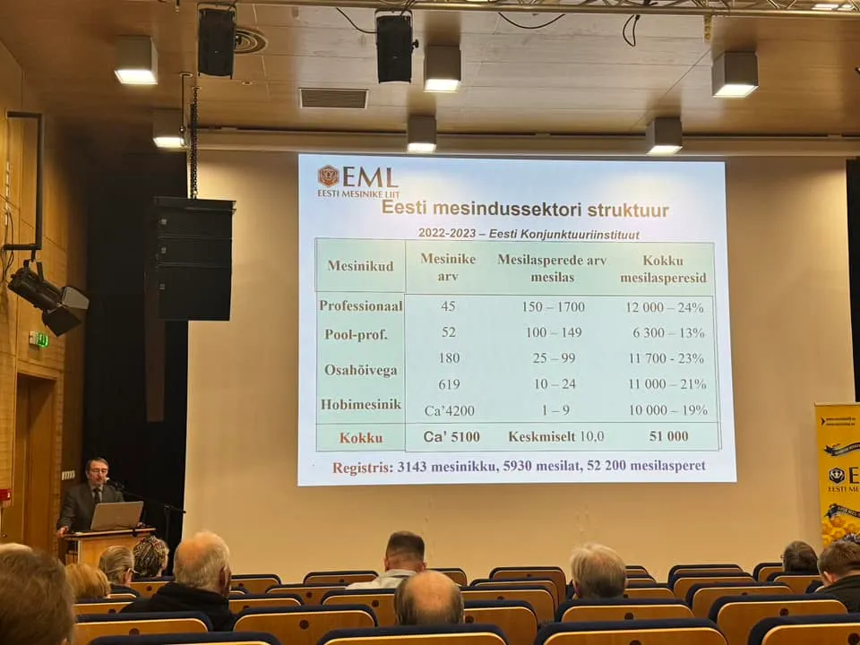

### Size of market
### Estonia

As we are Estonia-based, may be useful to track this data too to be able to extrapolate it on the world

- Estonia alone has over [~6400 apiaries](https://mesi.ee/) (these are registered only)
- 51000 bee colonies
- 5100 beekeepers
- 1.3M population
- thus 0.4 % of population, or ~ every 250th person is a beekeeper
- So almost any grown-up has someone related to beekeeping.

Source - [https://www.facebook.com/groups/108065015894483/posts/7747932681907640/](https://www.facebook.com/groups/108065015894483/posts/7747932681907640/?__cft__%5B0%5D=AZU3RQzLClErwsvGlOW3baE9TCxzykebDHTwgvk-ckV3adhny0TtNOoB0c0FqCKyqTLj3sLJpsG20d4shBfQCl7dpHxHzmyRfXbyOTKtC515WUEfDq-gDH55NDKaUcLlE0tX793llRymvhq7M-Cc8E0duQIFbJK7hGGsHf2CC0X_fwiMNnd3dH6B6hLEwP85O3A&__tn__=%2CO*F)

### Geographic distribution 

## Europe and the world
- The total number of beekeepers in Europe was estimated at 620 000 ([source](https://www.ncbi.nlm.nih.gov/pmc/articles/PMC3827320/))
- 94 Million hives in 2020 - statista
- 101 M colonies in 2021 - FAO ([source](https://www.notion.so/Marketing-Statistics-06c02962e8294bb98756a75155ce7a6b?pvs=21))

[https://ec.europa.eu/eurostat/en/web/products-eurostat-news/w/edn-20230519-1](https://ec.europa.eu/eurostat/en/web/products-eurostat-news/w/edn-20230519-1)

Source - [https://agriculture.ec.europa.eu/system/files/2022-04/market-presentation-honey_en_0.pdf](https://agriculture.ec.europa.eu/system/files/2022-04/market-presentation-honey_en_0.pdf)

