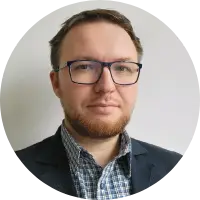

As we are non-profitable project yet, our team is mostly set of [volunteer](../../volunteer.md)s, researchers, students, enthusiasts and beekeepers.

You can find full list of all [**active and past contributors in our Notion**](https://gratheon.notion.site/Team-5ff38d33b8a2448ca02ffc26aed09278)

For formal and legal contact:
## Artjom Kurapov
- [linkedin](https://www.linkedin.com/in/kurapov/)
- [website](https://kurapov.ee)
- Roles:
	- Founder & CEO
	- [Fullstack engineer 📱](Roles/Fullstack%20engineer%20📱.md)
	- [Beekeeper & Community manager 🐝](Roles/Beekeeper%20&%20Community%20manager%20🐝.md) 

## Aleksei Prokopov
- https://begemotik.ee/
- [linkedin](https://www.linkedin.com/in/roboter/)
- https://github.com/roboter
- Role: [Robotics engineer 🦾](Roles/Robotics%20engineer%20🦾.md)

