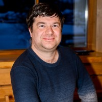

## Artjom Kurapov
- [linkedin](https://www.linkedin.com/in/kurapov/)
- [website](https://kurapov.ee)
- Roles:
	- Founder & CEO
	- [Fullstack engineer 📱](Roles/Fullstack%20engineer%20📱.md)
	- [Beekeeper & Community manager 🐝](Roles/Beekeeper%20&%20Community%20manager%20🐝.md)

## Aleksei Prokopov
- https://begemotik.ee/
- [linkedin](https://www.linkedin.com/in/roboter/)
- https://github.com/roboter
- Role: [Robotics engineer 🦾](Roles/Robotics%20engineer%20🦾.md)

### Vjatšeslav Kekšin
- Role: Research Advisor
- [linkedin](https://www.linkedin.com/in/vjatsheslav-kekshin-63455053/)
- [etis](https://www.etis.ee/cv/Vjat%C5%A1eslav_Kek%C5%A1in)

