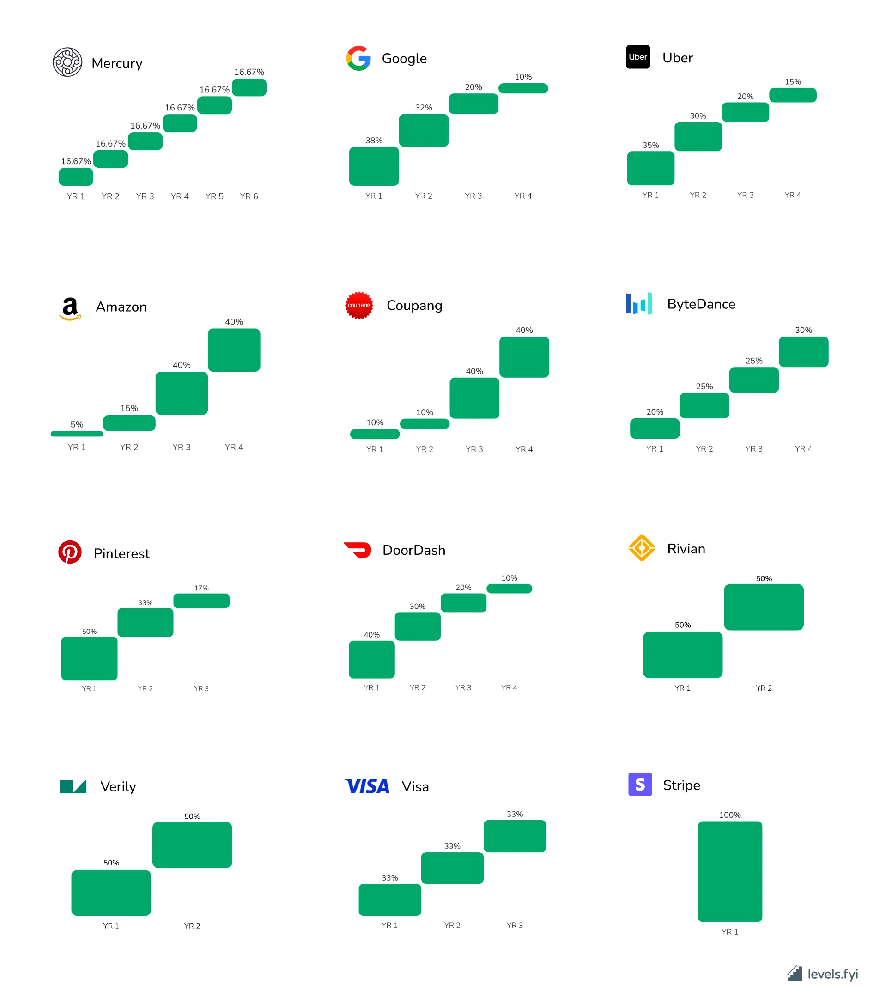

💡 This page is summarizing the rough **plan** of the equity program for the employees, founders, investors and advisors.

Equity is a mechanism of motivation and compensation at startups with early company stages when risks are high and cash is low as well as attracting and retaining professional talent at later company phases. 

Making everyone owning the company is part of our company values - [Team effort 🐝](🫀%20Culture%20and%20values/Team%20effort%20🐝.md) and [Gather value 🍯](🫀%20Culture%20and%20values/Gather%20value%20🍯.md)

## Ownership (CAP table)

This is an approximate expected distribution of shares over time.
For team option pool and founders, we will have 1 year cliff, 4 years of vesting time since official hiring and since first investments

| Who                                           | angel phase 🪽                                         | pre-seed 🫛                                                      | seed 🌱                                                                | series A 🌳                                 |
| --------------------------------------------- | ------------------------------------------------------ | ---------------------------------------------------------------- | ---------------------------------------------------------------------- | ------------------------------------------- |
| Founder                                       | 50% (50 M shares)                                      | 41.6%                                                            | 34%                                                                    | 28%                                         |
| Co-founder                                    | 10% (10 M shares)                                      |                                                                  |                                                                        |                                             |
| Team option pool                              | 45% (45 M)                                             | 37.5%                                                            | 31%                                                                    | 26%                                         |
| Investors                                     | 2% (2 M)  (if skipped, joins team option pool)   | +20% (20 M shares)                                               | +20% (24 M shares)                                                     | +20%  (28.8 M shares)                  |
| Advisors (~0.1-1% per person)            | 3% (3 M)                                               |                                                                  |                                                                        |                                             |
| Shares total                                  | 100 M                                                  | 120 M                                                            | 144 M                                                                  | 172.8 M                                     |
| Capital to raise in convertible loan (in EUR) | 40k                                                    | 1M                                                               | 3M                                                                     | 10M                                         |
| Post-money valuation                          | 2M                                                     | 7M                                                               | 15M                                                                    | 50M                                         |
| Fundraising goal                              | Bootstrap, develop prototype until investors are ready | Develop IoT Enter the market  Develop Entrance Observer | Enter the market with Entrance Observer  Develop Robotic Beehive | Enter market with Robotic Beehive in Europe |
| Share value                                   | 0.04                                                   | 6                                                                | 11.5                                                                   | 34                                          |
| Join time risk coefficient                    | 10                                                     | 5                                                                | 1.5                                                                    | 1                                           |
### Team option pool distribution and hiring plan

| Hiring stage | Role                         | Shares     | Percentage of total shares | Goal                                    |
| ------------ | ---------------------------- | ---------- | -------------------------- | --------------------------------------- |
| pre-seed 🫛  | **Full-stack Engineer**      | 2,500,000  | 2.50%                      | Web-app, general engineering            |
| pre-seed 🫛  | **Data Scientist (AI/ML)**   | 1,500,000  | 1.50%                      | Timeseries analytics, vision processing |
| seed 🌱      | CMO                          | 2,000,000  | 2.00%                      | Marketing campaigns, building community |
| seed 🌱      | **CTO**                      | 5,000,000  | 5.00%                      | General engineering, team work          |
| seed 🌱      | Infrastructure / SRE         | 1,000,000  | 1%                         | Scaling and supporting microservices    |
| seed 🌱      | **Robotics Engineer**        | 1,500,000  | 1.50%                      | Develop robotic beehive                 |
| seed 🌱      | **Robotics Engineer**        | 1,500,000  | 1.50%                      | Develop robotic beehive                 |
| series A 🌳  | **CPO**                      | 2,500,000  | 2.50%                      |                                         |
| series A 🌳  | **Community Manager**        | 1,000,000  | 1.00%                      |                                         |
| series A 🌳  | Head of Support              | 2,000,000  | 2.00%                      |                                         |
| series A 🌳  | Head of Sales                | 1,500,000  | 1.50%                      |                                         |
|              | **Remaining in Option Pool** | 13,500,000 | 13.50%                     |                                         |

## Gratheon-specific clarifications
    
- Options are **virtual** and are not affecting the legal body of Gratheon OÜ registry as mentioned in [Legal training by Hedman](https://www.notion.so/Legal-training-by-Hedman-6144b4856a8a4ffbbe28f145d4b4470e?pvs=21), mostly because its hard to alter real shares in the registry.
    
- Options are given out (vested) in equal monthly portions over 4 years with 1 year cliff
  
- Note that equity distribution is an investment opportunity stake in the company, but it does not give voting (board control) rights in the same proportions. This is done intentionally so that 
	- team and investment pools could be larger
	- keep control in founder hands until board is sufficiently large enough
	- team could choose balance between salary and equity
    
## Terminology clarification

- **Equity**: Broadly refers to ownership in the company.
- **Shares**: Units of ownership that represent a portion of equity.
- **Options**: A contract that allows someone to buy shares at a predetermined price in the future.
- **Option Pool**: A reserved portion of shares set aside for distribution to employees or other stakeholders via options.
- **Cliff**: A minimum period before any equity (like stock options) becomes accessible to the employee. For example, with a 1-year cliff, employees must stay for at least one year to start receiving any equity.
- **Vesting**: The process by which an employee earns equity over time, usually on a fixed schedule (e.g., 25% per year for four years).
- **Convertible Loan**: A type of financing where investors lend money to the company, which can later be converted into equity (shares) under specific conditions, often at a discount or with other perks

## What is equity

Equity in a startup or a small business can be an attractive form of compensation for employees and partners, as it offers a share in the potential future success of the company. Equity represents ownership in the company, and it can take several forms. Common types include stock options, restricted stock, and performance shares, each with its unique characteristics and tax implications.

Equity is often given to early employees as part of their compensation package, but it can also be used to attract high-quality talent as the company grows. The amount of equity is usually based on the employee's role, seniority, and when they joined the company. It's worth noting that equity is not the same as immediate cash, and its value is tied to the success and profitability of the business. As such, it represents a long-term investment in the company.

When a startup decides to offer equity, it essentially divides ownership of the company into a predetermined number of shares. These shares may then be distributed among the founders, investors, and employees. The percentage of ownership that each share represents is inversely proportional to the total number of shares. In other words, the more shares that exist, the less ownership each one represents.

For employees, receiving equity means they are being given a certain number of shares in the company. This can either be done directly or through an equity compensation plan, such as a stock option plan. Under such a plan, employees are given the option to purchase a set number of shares at a fixed price, usually lower than market value. This becomes more valuable as the company's value increases.

However, equity also comes with risks. If the startup fails, the value of the equity could become worthless. Furthermore, there may be restrictions on when and how equity can be sold, which means employees may not be able to realize the value of their equity immediately. Therefore, while equity can have great rewards, it is important for recipients to understand the potential risks and limitations.

- If you leave the company, you lose options. Company can print more shares, mostly for new investors

## ⛲ Team option pool calculation

**Assuming** we are successful and do reach 100 employees after series A with initial option pool of 380 000 shares equity and do not print more shares, on average **each employee gets ~ 3800 shares** at 34 EUR per share valuation.

### Hierarchical equity

Flat equity model does not take into consideration **join time** which involves higher risks. And it does not differentiate by **skill level**.

To combat this we add `Join time risk coefficient` (above) that depends on company phase (round) and `Equity staff level coefficient` that depends on experience / seniority level. Both affect the real amount of shares provided to the person.

The negative side is that it is not possible to balance in advance amount of employees and their levels. So to calculate base level (2000 shares), we assume that we can hire 100 Senior engineers + have some buffer for

Vesting in different companies, source - **Levels.fyi**

## Software to consider

- [koos.io](http://koos.io)
- [saltox.co](http://saltox.co)
- carta

<iframe width="100%" height="400" src="https://www.youtube.com/embed/5oO3k5ghKT8" title="STARTUP EQUITY - Who Gets What and Why? How does it work?" frameborder="0" allow="accelerometer; autoplay; clipboard-write; encrypted-media; gyroscope; picture-in-picture; web-share" referrerpolicy="strict-origin-when-cross-origin" allowfullscreen></iframe>

