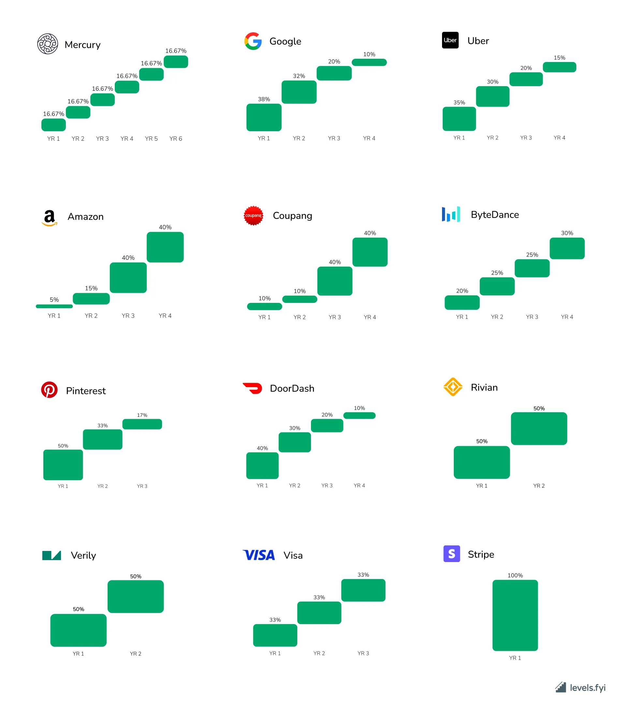

💡 This page is summarizing the rough **plan** of the equity program for the employees, founders, investors and advisors.

Equity is a mechanism of motivation and compensation at early company stages when risks are high and cash is low as well as attracting and retaining professional talent at later company phases. Making everyone owning the company is part of our company values - [Team effort 🐝](🫀%20Culture%20and%20values/Team%20effort%20🐝.md) and [Gather value 🍯](🫀%20Culture%20and%20values/Gather%20value%20🍯.md)

- If you leave, you lose options. Company can print more shares, mostly for new investors.
    
- Options are **virtual** and are not affecting the legal body of Gratheon OÜ registry as mentioned in [Legal training by Hedman](https://www.notion.so/Legal-training-by-Hedman-6144b4856a8a4ffbbe28f145d4b4470e?pvs=21), mostly because its hard to alter real shares in the registry.
    
- Options are given out (vested) in portions over (typically) 5 years
    
- Options are not shares. Its a right to buy shares at fixed (low) price. Typically at exit events they are converted to cash.
    
- Equity is thus very much trust-based. Company is interested in its employees owning the company.
    
- ChatGPT, what is equity?
    
    Equity in a startup or a small business can be an attractive form of compensation for employees and partners, as it offers a share in the potential future success of the company. Equity represents ownership in the company, and it can take several forms. Common types include stock options, restricted stock, and performance shares, each with its unique characteristics and tax implications.
    
    Equity is often given to early employees as part of their compensation package, but it can also be used to attract high-quality talent as the company grows. The amount of equity is usually based on the employee's role, seniority, and when they joined the company. It's worth noting that equity is not the same as immediate cash, and its value is tied to the success and profitability of the business. As such, it represents a long-term investment in the company.
    
    When a startup decides to offer equity, it essentially divides ownership of the company into a predetermined number of shares. These shares may then be distributed among the founders, investors, and employees. The percentage of ownership that each share represents is inversely proportional to the total number of shares. In other words, the more shares that exist, the less ownership each one represents.
    
    For employees, receiving equity means they are being given a certain number of shares in the company. This can either be done directly or through an equity compensation plan, such as a stock option plan. Under such a plan, employees are given the option to purchase a set number of shares at a fixed price, usually lower than market value. This becomes more valuable as the company's value increases.
    
    However, equity also comes with risks. If the startup fails, the value of the equity could become worthless. Furthermore, there may be restrictions on when and how equity can be sold, which means employees may not be able to realize the value of their equity immediately. Therefore, while equity can have great rewards, it is important for recipients to understand the potential risks and limitations.

<iframe width="100%" height="400" src="https://www.youtube.com/embed/5oO3k5ghKT8" title="STARTUP EQUITY - Who Gets What and Why? How does it work?" frameborder="0" allow="accelerometer; autoplay; clipboard-write; encrypted-media; gyroscope; picture-in-picture; web-share" referrerpolicy="strict-origin-when-cross-origin" allowfullscreen></iframe>

## Aggregated CAP table, an example

Approximate expected distribution of shares over time.

For team option pool and founders, we will have 1 year cliff, 4 years of vesting time.

|Who|angel phase ⛳|pre-seed|seed|series A|
|---|---|---|---|---|
|Founder|60% (600 000)|54.3%||41%|
|Team option pool|38% (380 000)|34.3%||26%|
|Investors|2% (2 000)|+20% (200 000)|+10% (110 000)|+20% (242 000)|
|Advisors|||||
|(~0.1-1% per person)|5% (50 000)||||
|Capital to raise in convertible loan|40k||||
|in convertible notes|1M||||
|1.4M|10M||||
|Fundraising goal|for software and hardware prototype development|development runway for the prototype to be production-ready|enter the market|scale business in Europe|
|Shares total|1 000 000|1 200000|1 210 000|1 452 000|
|Post-money valuation|2M|7M|14M|50M|
|Share value|0.04|6|11.5|34|
|Join time risk coefficient|10|5|1.5|1|

## ⛲ Team option pool calculation

**Assuming** we are successful and do reach 100 employees after series A with initial option pool of 380 000 shares equity and do not print more shares, on average **each employee gets ~ 3800 shares** at 34 EUR per share valuation.

### Hierarchical equity

Flat equity model does not take into consideration **join time** which involves higher risks. And it does not differentiate by **skill level**.

To combat this we add `Join time risk coefficient` (above) that depends on company phase (round) and `Equity staff level coefficient` that depends on experience / seniority level. Both affect the real amount of shares provided to the person.

The negative side is that it is not possible to balance in advance amount of employees and their levels. So to calculate base level (2000 shares), we assume that we can hire 100 Senior engineers + have some buffer for

[Untitled](https://www.notion.so/8467f1a9b27643efb23f567f66a1981f?pvs=21)

### Investment funding rounds

At each step of funding round, some equity is given away to the investors in return for raised capital. New investor gets new shares, nothing happens to previously given away shares, thus ownership % is diluted but valuation of the company increases.

Vesting in different companies, source - **Levels.fyi**

## Software to consider

- [koos.io](http://koos.io)
- [saltox.co](http://saltox.co)
- carta