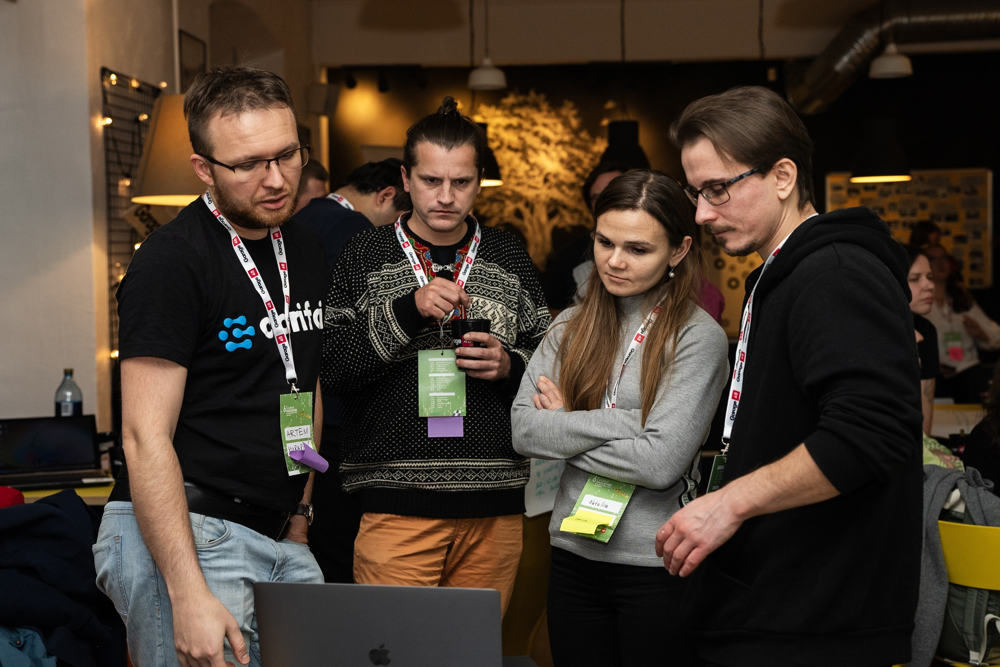

Here we list all [volunteers](volunteer.md) that have helped us. Consider this as a hall of fame

## Engineering

| Person name                                                                   | Focus                                                                                                                                                                                |
| ----------------------------------------------------------------------------- | ------------------------------------------------------------------------------------------------------------------------------------------------------------------------------------ |
| [Aleksei Prokopov](https://www.linkedin.com/in/roboter/)                      | Worked on digital scales IoT device (hardware)                                                                                                                                       |
| [Vjatšeslav Kekšin](https://www.linkedin.com/in/vjatsheslav-kekshin-63455053) | Published on our [whitepaper](https://easychair.org/publications/preprint/QGJN) (research)                                                                                           |
| [Kurban Ramazanov](https://www.linkedin.com/in/kurban-ramazanov-2b50b026b/)   | Helped with UI/UX, designing prototypes to imporove web-app experience                                                                                                               |
| [Alonso Solis](https://www.linkedin.com/in/alonso-solis-a5b88020a/)           | participated in andmetorm hackathon, worked on UI design and FE components                                                                                                           |
| Adrian Ala                                                                    | participated in andmetorm hackathon, worked on UX flow and pitching                                                                                                                  |
| [Ahmed Daoudi](https://www.linkedin.com/in/ahmed-daoudi-aa693a230/)           | Helped with telemetry-api, building initial service version in express/nodejs                                                                                                        |
| [Muhammad Zain Shakeel](https://www.linkedin.com/in/zains96/)                 | Helped with 3D model of the robotic beehive                                                                                                                                          |
| [Natalia Kinash](https://www.linkedin.com/in/nataliia-kinash/)                | Participated in the hackathon where she helped Reinis Indans with satellite imagery processing                                                                                       |
| [Reinis Indans](https://www.linkedin.com/in/reinis-indans/)                   | Participated in a hackathon where he did most of the heavy work on data collection and model training for satellite pollination sub-project - satellite-pollination-map microservice |

## Testing

| Person name                                                                 | Focus                                 |
| --------------------------------------------------------------------------- | ------------------------------------- |
| [Arina Turgeneva](https://www.linkedin.com/in/arina-turgeneva-07041a310/)   | Helped with extensive web-app testing |
| [Maria Lutsiv](https://www.linkedin.com/in/marija-lutsiv-751bb7139/)        | helped with web-app testing           |
| [Anastassia Tsalko](http://www.linkedin.com/in/anastassia-tsalko-62a9882b0) | helped with web-app testing           |
| [Andrei Kuzmin](https://www.linkedin.com/in/angpeu/)                        | helped with web-app testing           |
| [Vladislav Tjagunovitš](https://www.linkedin.com/in/vladislav-tjagunovits/) | helped with web-app testing           |
## Product Ideas

| Person name                                                                 | Focus                                                        |
| --------------------------------------------------------------------------- | ------------------------------------------------------------ |
| [Artjom Shestajev](https://www.linkedin.com/in/artjom-shestajev/)           | product development ideas                                    |
| [Roop Runjan Khan](https://www.linkedin.com/in/roop-ranjan-khan-234a9014b/) | participated in andmetorm hackathon                          |
| [Aleksei Boris](https://www.linkedin.com/in/alekseiboris/)                  | Participated in 2 hackathons and helped with pitching        |
| [Olena Stoliarova](https://www.linkedin.com/in/olena-stoliarova/)           | participated in a Climathon hackathon, helping with pitching |

**Thank you all!