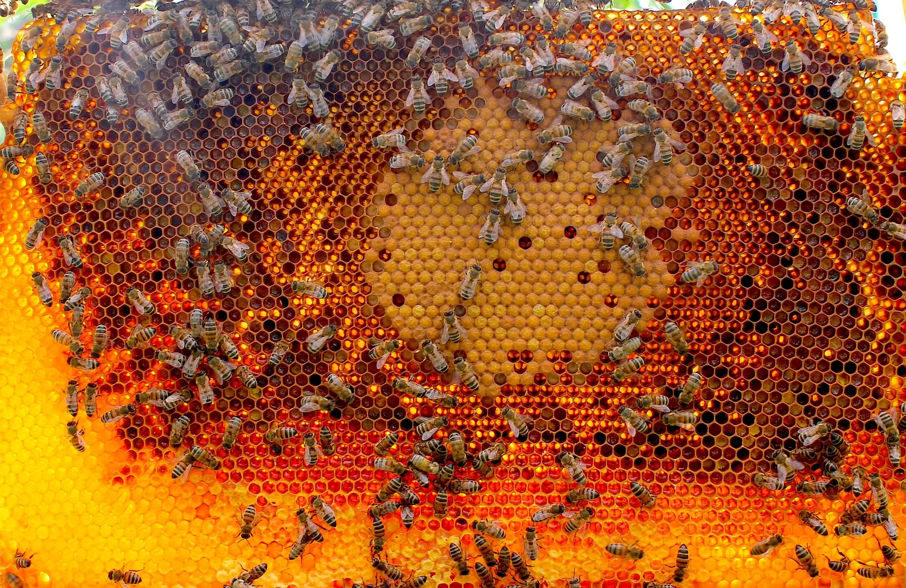

Gratheon develops open, modular robotic beehive as a data service for [👨🏻‍🚀 Semi-professional beekeepers](products/clients/👨🏻‍🚀%20Semi-professional%20beekeepers.md) to save bees 🐝, improve efficiency and scale beekeeping. Globally we increase food security through precise pollination.

## Pitch
📢 We are building a robotic beehive! 5 years ago I became a beekeeper to improve pollination of my garden and to take care of the super organisms of bees.

Soon I understood that bees can [🧶 Swarm](./🌨️%20Problems/🧶%20Swarming.md) and get [🦀 Varroa Mite Infestations](./🌨️%20Problems/🦀%20Infestations.md). 
I had to regularly lift heavy beehives sections to inspect and treat bees.
Some colonies got weak and died over the winter. 
Losing a colony is not just 300 euros of monetary loss, its also a personal failure. 
On average 20% to 40 % of colonies die every year.

Imagine a new type of beehive that inspects the bees automatically.
This would save time, reduce loss of bees, require less inspections.
[👨🏻‍🚀 semi-professional beekeepers](./products/clients/👨🏻‍🚀%20Semi-professional%20beekeepers.md) could have more beehives and could see colony development over time automatically. 
[🧑🏻‍🌾 Farmers](products/clients/🧑🏻‍🌾%20Farmers.md) would get more pollination services and have 40% more crop yields.

[Our team](company/Team/index.md) are experienced engineers and researchers from companies like Pipedrive, Clarifai, Fits.me, Taltech and we are raising 1M pre-seed investments for 2 years of runway. Angels and [volunteers](❤️‍🔥%20Volunteers.md) are also welcome.

Join us to help 2 million beekeepers and their cute & fuzzy bees.

### For the investors 💶
- [📑 deck.pdf](../static/deck.pdf) or [google docs](https://docs.google.com/presentation/d/e/2PACX-1vRAO6JHPczQ2u8Z8ph3g7oa2UPk_0gzV-BpPC30R0AFjAL-1Bqqhrum59NEHlI7lCSbyurKZiu8-JuO/pub?start=false&loop=false&delayms=3000)
- 💁🏻 B2B (beekeepers) + B2B2B (beekeepers reselling services to farmers)
- SaaS / Deeptech / Agrotech / Robotics

<iframe width="100%" height="400" src="https://www.youtube.com/embed/ikBgcNUSc9I" frameborder="0" allow="accelerometer; autoplay; clipboard-write; encrypted-media; gyroscope; picture-in-picture; web-share" referrerpolicy="strict-origin-when-cross-origin" allowfullscreen></iframe>

<iframe width="100%" height="400" src="https://www.youtube.com/embed/-g1QX2SPUrw" title="Gratheon - 5 min pitch" frameborder="0" allow="accelerometer; autoplay; clipboard-write; encrypted-media; gyroscope; picture-in-picture; web-share" referrerpolicy="strict-origin-when-cross-origin" allowfullscreen></iframe>

## Numbers and Metrics

- 🐣 Founded legally in 2012 (for web-development)
- 💡 [Idea formulated in 2020](https://www.youtube.com/watch?v=gM3AJEAhmXc)
- 🖮 Coding started in 2022
- 📢 Pitches in 2023
- 🌍 Web-app live - [100+ registered users](https://www.notion.so/KPIs-and-Business-metrics-a0707c4260194f36b7f86dfd28964edf?pvs=21)
- 📱 Android app live 10+ installs
- 🫀 12+ [volunteering contributors](❤️‍🔥%20Volunteers.md)
- 🚀 Bootstrapping, pre-seed phase
- 🪽 looking for angel investments for IoT field testing

