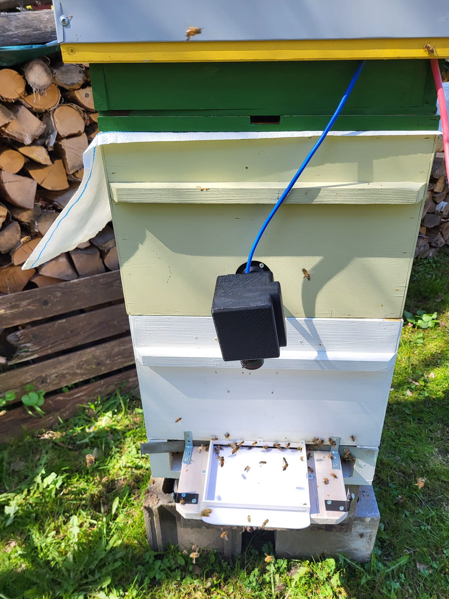
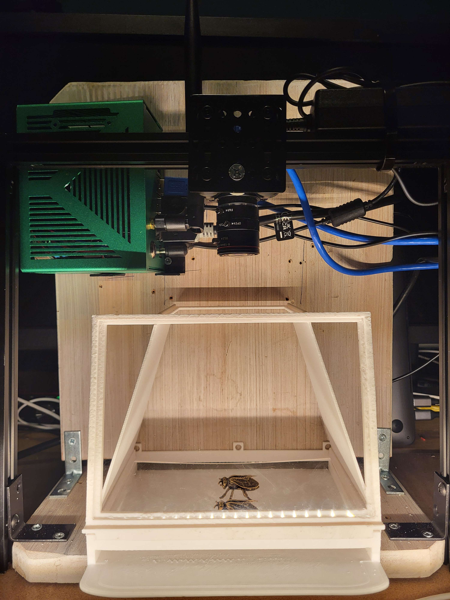
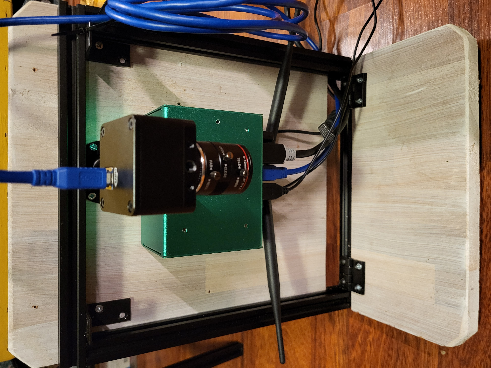

`status: prototype, 30% complete`

💡 Entrance Observer is a set of cameras and a hardware device that analyze beehive entrance. It records a video stream, runs AI analysis that sends it all to [web app](../web_app/web_app.md). With custom setup, one device can watch for up to 4 beehive entrances

### Problem focus
Out of all beekeeping issues, this product is helping with these:
- [💢 Hornet attacks](../../🌨️%20Problems/💢%20Hornet%20attacks.md)
- [💢 Robbing state](../../🌨️%20Problems/💢%20Robbing%20state.md)
- [🦀 Infestations](../../🌨️%20Problems/🦀%20Infestations.md)
- [🧶 Swarming](../../🌨️%20Problems/🧶%20Swarming.md)
- [🦀 Diseases](../../🌨️%20Problems/🦀%20Diseases.md)
- [💀 Colony without a queen](../../🌨️%20Problems/💀%20Colony%20without%20a%20queen.md)
- [🤢 Pesticide poisoning](../../🌨️%20Problems/🤢%20Pesticide%20poisoning.md)
## Target audience

- [🧑‍🚀 Hobby beekeepers](../clients/🧑‍🚀%20Hobby%20beekeepers.md)
- [👨🏻‍💻 Tech-savvy engineers](../clients/👨🏻‍💻%20Tech-savvy%20engineers.md)
- [👩🏻 Tech scale-up companies](../clients/👩🏻%20Tech%20scale-up%20companies.md)

## Features

Similar ideas from [🔬 Machine Learning and Computer Vision Techniques in Continuous Beehive Monitoring Applications A Survey](https://gratheon.com/research/Machine%20Learning%20and%20Computer%20Vision%20Techniques%20in%20Continuous%20Beehive%20Monitoring%20Applications%20A%20Survey)

### History

Prototype v4 at field testing. Camera has protective case. Missing the landing board protective cone as it needs artificial lighting

Prototype v3. Added protective cone, now idea is to have CPU/GPU block separated and moved into the hive roof to have less devices on the entrance, have camera integrated with the cone, have WIFI antennae and power blocks farther away from the bees.

Prototype v1 version. Camera at the center on a monopod, jetson orin nano at the center with wiring and antennae facing down
