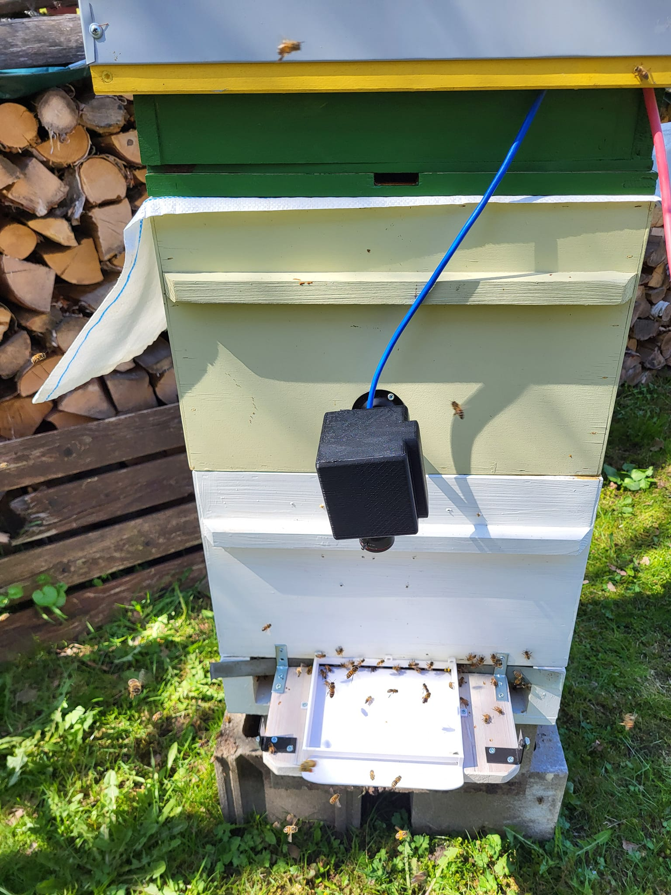

`status: proof-of-concept, 30% complete`

💡 Entrance Observer is a set of cameras and a hardware device that analyse beehive entrance. It records a video stream, runs AI analysis that sends it all to web-app

One device is watches for up to 4 beehive entrances. Over time, we can try building a more affordable version that uses worse cameras, less GPU and less energy

## Target audience

- [🧑‍🚀 Hobby beekeepers](../clients/🧑‍🚀%20Hobby%20beekeepers.md)
- [👨🏻‍💻 Tech-savvy engineers](../clients/👨🏻‍💻%20Tech-savvy%20engineers.md)
- [👩🏻 Tech scale-up companies](../clients/👩🏻%20Tech%20scale-up%20companies.md)

[Prototype Design](https://www.notion.so/Prototype-Design-8fc6ea808b95434da228c48b6d195f12?pvs=21)
[Bill of Materials (observer v2)](https://www.notion.so/Bill-of-Materials-observer-v2-903d592290024f3eb48991fcdf1d80f0?pvs=21)

## Features

Similar ideas from [🔬Machine Learning and Computer Vision Techniques in Continuous](https://www.notion.so/gratheon/Machine-Learning-and-Computer-Vision-Techniques-in-Continuous-Beehive-Monitoring-Applications-A-Sur-a7250330ded54fccb9c6765407372708?pvs=24)

### History

Prototype v4 at field testing. Camera has protective case. Missing the landing board protective cone as it needs artificial lighting

Prototype v3. Added protective cone, now idea is to have CPU/GPU block separated and moved into the hive roof to have less devices on the entrance, have camera integrated with the cone, have WIFI antennae and power blocks farther away from the bees.

Prototype v1 version. Camera at the center on a monopod, jetson orin nano at the center with wiring and antennae facing down

## Cost

Based on materials ~ 600-1200 EUR depending on amount of hives