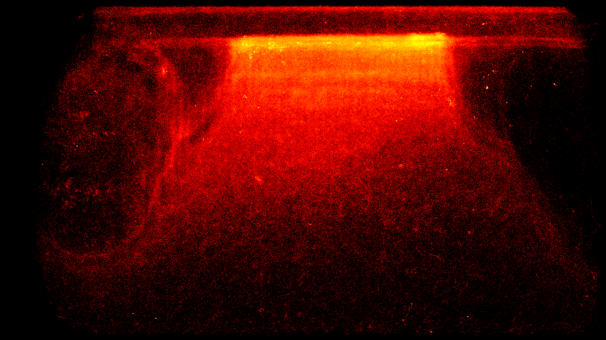

Given all of the bee track movements,  we can generate a heatmap of bee locations at the entrance to better understand long-term bee behaviour and potentially improve efficiency of the landing board to 

