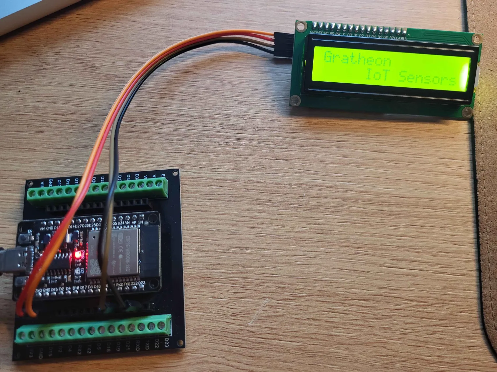

`status: prototype, 40% complete`

🌡️ Beehive IoT sensors product essentially is smart scales that is equipped with additional sensors and communication chips that periodically measures hive state and send data to the [web app](../web_app/web_app.md). Such aggregated data can help beekeepers to keep track of the colony in the field with smallest budget.

### Problem focus
Out of all beekeeping issues, this product is helping with these:
- [🧶 Swarming](../../🌨️%20Problems/🧶%20Swarming.md)
- [🍽️ Bee colony starvation](../../🌨️%20Problems/🍽️%20Bee%20colony%20starvation.md)
- [💢 Robbing state](../../🌨️%20Problems/💢%20Robbing%20state.md)
- [🐻 Bears destroying hives & colonies](../../🌨️%20Problems/🐻%20Bears%20destroying%20hives%20&%20colonies.md)
- [🗃️ Storm wind collapsing beehives](../../🌨️%20Problems/🗃️%20Storm%20wind%20collapsing%20beehives.md)
- [🌲 Distant locations](../../🌨️%20Problems/🌲%20Distant%20locations.md)

## Target audience
- [🧑‍🚀 Hobby beekeepers](../clients/🧑‍🚀%20Hobby%20beekeepers.md)
- [👨🏻‍🚒 Industrial beekeepers](../clients/👨🏻‍🚒%20Industrial%20beekeepers.md)
- [👩🏼‍🏫 Urban beekeepers](../clients/👩🏼‍🏫%20Urban%20beekeepers.md)

