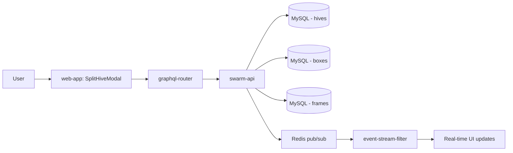

## ↔️ Split Colony

**Status**: `feature` | **Development Stage**: `stable` | **Priority**: `high`

### 🎯 Purpose
Create a new hive (nucleus colony) by moving selected frames from an existing strong colony. This prevents swarming, expands operations, and allows creation of backup colonies.

### 🎭 User Story
- As a beekeeper
- I want to split a strong colony by moving frames to a new hive
- So that I can prevent swarming, increase my colony count, or create nucleus colonies without losing historical lineage data

### 🚀 Key Benefits
- **Swarm Prevention**: Remove crowding before swarm cells appear
- **Colony Expansion**: Grow number of productive hives
- **Nucleus Creation**: Build small colonies for queen introduction or sales
- **Historical Tracking**: Parent-child relationship preserved with split dates
- **Flexible Selection**: Choose 1-10 frames from any boxes
- **Auto-naming**: Multi-language name generator for new hives

### 🐝 Beekeeping Context

Colony splitting is fundamental beekeeping practice used to:
- **Prevent Swarming**: Strong colonies swarm naturally in spring/summer
- **Increase Colony Count**: Build apiary size from existing strong colonies
- **Make Nucs**: Create small colonies for queen mating or sales
- **Replace Losses**: Build new colonies to replace winter losses
- **Share Genetics**: Distribute good queen genetics across multiple hives

<iframe width="560" height="315" src="https://www.youtube.com/embed/E-W3XCv4OaA" title="How to Split a Beehive into 2 Nucs and Parent Colony" frameborder="0" allow="accelerometer; autoplay; clipboard-write; encrypted-media; gyroscope; picture-in-picture; web-share" referrerpolicy="strict-origin-when-cross-origin" allowfullscreen></iframe>

*Video: How to Split a Beehive - The Norfolk Honey Co*

### 🔧 Technical Overview

**Architecture:**



**Components:**
- **swarm-api**: Core split logic and database operations
  - `splitHive` mutation with frame validation (1-10 frames)
  - New hive creation with lineage tracking
  - Box creation in new hive
  - Frame movement and position updates
  - Random name generation API
- **web-app**: User interface for colony splitting
  - SplitHiveModal component
  - Visual frame selection with previews
  - Box-grouped frame display
  - Real-time selection counter
  - Multi-language name generator
- **Redis**: Real-time event broadcasting
  - `hive:split` event for new hive creation

**Database Schema:**

```sql
-- Migration: add parent_hive_id and split_date tracking
ALTER TABLE hives
  ADD COLUMN parent_hive_id INT UNSIGNED NULL,
  ADD COLUMN split_date DATETIME NULL,
  ADD INDEX idx_parent_hive_id (parent_hive_id);
```

**Split Process:**

1. **Frame selection**: User selects 1-10 frames from source hive
2. **Name generation**: Auto-generate or custom name for new hive
3. **Validation**: Check frame count, hive ownership, editability
4. **Hive creation**: Create new hive record with parent reference
5. **Box creation**: Add single DEEP box at position 0 in new hive
6. **Frame movement**: Move selected frames to new box
7. **Position update**: Assign sequential positions (0, 1, 2...)
8. **Event broadcast**: Publish `hive:split` event
9. **Redirect**: Navigate to new hive view

### 📋 How to Use

#### 1. Access Split Colony Feature

1. Navigate to a strong hive (recommended 8+ frames of bees)
2. Ensure hive is active (not collapsed or merged)
3. Click **"Split Hive"** button at top of hive view (after "Create Inspection")
4. Split Hive modal opens

#### 2. Generate New Hive Name

**Auto-generated names:**
- Click 🔄 refresh button for new random name
- Multi-language support: English, Russian, Estonian, Turkish, Polish, German, French
- Names are female names suitable for bee colonies (Luna, Aurora, etc.)

**Custom names:**
- Type any name in the text input
- Name is required before submitting

#### 3. Select Frames

**Selection interface:**
- Frames organized by box (Box 3, Box 2, Box 1...)
- Each frame shows preview image (if available)
- Click checkbox or frame to select/deselect
- Selection counter updates: "Selected 3/10 frames"

**Frame selection tips:**
```
Box 3 (DEEP):
☑️ Frame 1 [brood]  ☐ Frame 2 [honey]  ☑️ Frame 3 [brood]

Box 2 (SUPER):  
☐ Frame 1 [honey]   ☐ Frame 2 [honey]   ☐ Frame 3 [honey]

Box 1 (DEEP):
☐ Frame 1 [pollen]  ☑️ Frame 2 [brood]  ☐ Frame 3 [empty]
```

**Selection rules:**
- **Minimum**: Must select at least 1 frame
- **Maximum**: Can select up to 10 frames
- **Any box**: Select from DEEP, SUPER, or other boxes
- **Any position**: Order doesn't matter

**Recommended selection for strong split:**
- 2-3 frames of capped brood
- 1-2 frames of eggs/young larvae
- 1-2 frames of honey/pollen (food)
- 1-2 frames with bees covering them

#### 4. Confirm Split

1. Review selected frame count
2. Check new hive name
3. Click **"Split Hive"** button
4. System processes split automatically
5. Redirect to new hive view

#### 5. View Split Results

**New Hive (Child):**
- Shows "Split from [Parent Name]" with date and link
- Single DEEP box at position 0
- Selected frames in sequential positions (0, 1, 2...)
- Same apiary as parent
- Inherits family (queen line) from parent
- Fully editable and independent

**Parent Hive (Source):**
- Shows "Child hives: [Child Names]" with dates
- All boxes remain in original positions
- Frame count reduced by number moved
- Remains fully active and editable
- Can be split again if still strong

### 🎯 Frame Selection Strategy

#### For Nucleus Colony (3-5 frames):
```
✅ 2 frames of brood (1 capped, 1 eggs/larvae)
✅ 1 frame of honey
✅ 1 frame of pollen
✅ 1 foundation or drawn comb
```

#### For Full Split (6-10 frames):
```
✅ 3-4 frames of brood (mix of ages)
✅ 2-3 frames of food (honey/pollen)
✅ 2-3 frames with nurse bees
✅ 1-2 drawn combs or foundation
```

#### What to Include:
- ✅ **Capped brood**: Will emerge soon, build population
- ✅ **Eggs/larvae**: Ensures continuity, can make emergency queen
- ✅ **Food stores**: Honey and pollen for initial survival
- ✅ **Nurse bees**: Young bees that stay in hive
- ✅ **Drawn comb**: Ready for egg-laying

#### What to Avoid:
- ❌ Too much open brood (needs many nurse bees)
- ❌ All capped brood (no eggs for emergency queen)
- ❌ Only young frames (need food stores)
- ❌ Queen cells (unless intentional)
- ❌ Diseased or damaged combs

### 🔄 Split Types

#### Swarm Prevention Split
**Timing**: Before swarm cells appear
**Selection**: 5-7 frames including queen cells
**Outcome**: Reduce crowding, prevent swarming

#### Walk-Away Split
**Timing**: Peak brood season
**Selection**: Frames with eggs (no queen)
**Outcome**: Bees raise emergency queen from eggs

#### Nuc Creation
**Timing**: Spring/summer
**Selection**: 3-5 frames with brood and food
**Outcome**: Small colony for queen introduction or sale

#### Equal Split
**Timing**: Strong colony, good flow
**Selection**: Half of frames (even distribution)
**Outcome**: Two equal-strength colonies

### 📊 GraphQL API

**Mutation:**
```graphql
mutation SplitHive {
  splitHive(
    sourceHiveId: "123"
    name: "Luna"
    frameIds: ["456", "457", "458"]
  ) {
    id
    name
    parentHive {
      id
      name
    }
    splitDate
  }
}
```

**Query - Parent Hive:**
```graphql
query GetParentHive {
  hive(id: "123") {
    id
    name
    childHives {
      id
      name
      splitDate
    }
  }
}
```

**Query - Child Hive:**
```graphql
query GetChildHive {
  hive(id: "456") {
    id
    name
    parentHive {
      id
      name
    }
    splitDate
  }
}
```

**Random Name Generation:**
```graphql
query {
  randomHiveName(language: "en")
}
```

Supported languages: `en`, `ru`, `et`, `tr`, `pl`, `de`, `fr`

### 🎨 Visual Interface

**Modal Layout:**
```
┌──────────────────────────────────────────┐
│ Split Hive                         [X]   │
├──────────────────────────────────────────┤
│                                          │
│ New Hive Name: [Luna        ] [🔄]      │
│                                          │
│ Select frames (3/10):                    │
│                                          │
│ Box 3 (DEEP):                            │
│ ☑️ [Frame 1 img] ☐ [Frame 2 img]        │
│ ☑️ [Frame 3 img] ☐ [Frame 4 img]        │
│                                          │
│ Box 2 (SUPER):                           │
│ ☐ [Frame 1 img] ☐ [Frame 2 img]        │
│                                          │
│ Box 1 (DEEP):                            │
│ ☐ [Frame 1 img] ☑️ [Frame 2 img]        │
│                                          │
│        [Cancel]      [Split Hive]        │
└──────────────────────────────────────────┘
```

**Frame Display:**
- Thumbnail preview (if image available)
- Checkbox for selection
- Selected frames highlighted
- Hover effects for interactivity

### 📝 After Split Care

**New Hive (Split) Needs:**
1. **Queen**: Add queen, queen cell, or let bees raise emergency queen
2. **Food**: Check stores, may need feeding
3. **Protection**: Reduce entrance size (smaller colony = easier to defend)
4. **Monitoring**: Check weekly for queen acceptance and brood
5. **Positioning**: Place in different apiary location if possible (flying bees return to original location)

**Parent Hive:**
1. **Population**: Will rebuild over time
2. **Queen**: Check that queen is still present and laying
3. **Space**: May need to remove extra boxes temporarily
4. **Inspection**: Monitor for swarming signs if still strong

### ⚠️ Important Considerations

**Timing:**
- ✅ **Best**: Spring/early summer during nectar flow
- ✅ **Good**: Mid-summer with strong colony
- ⚠️ **Caution**: Late summer (less time to build up)
- ❌ **Avoid**: Late fall or winter

**Colony Strength:**
- ✅ Strong colony: 8+ frames of bees, multiple boxes
- ⚠️ Medium colony: 6-8 frames (small split only)
- ❌ Weak colony: Don't split, needs to build up

**Weather:**
- ✅ Warm days (bees can forage)
- ✅ Active nectar flow (food available)
- ❌ Cold weather (stress on bees)
- ❌ No flow (may need feeding)

**Validation Rules:**
- Must select 1-10 frames
- Source hive must exist and be owned by user
- Source hive must be editable (not collapsed/merged)
- Hive name required
- Frames must exist in source hive

### 🔗 Related Features

- **[Join Colonies](./🫶🏻%20Join%20colonies.md)**: Opposite operation - merge two hives together
- **Create Inspection**: Document hive before/after split
- **Collapse Hive**: Mark dead/inactive colony
- **Delete Hive**: Remove hive permanently

### 🐛 Troubleshooting

**"Must select between 1 and 10 frames"**
- Select at least 1 frame
- Don't exceed 10 frame maximum
- Counter shows current selection

**"Please enter a name"**
- Hive name field is empty
- Type name or use random generator

**"Source hive not found"**
- Hive may have been deleted
- Check hive ownership

**Split button not visible:**
- Hive must be active (not collapsed/merged)
- User must have edit permissions

**Frames not showing:**
- Hive may have no frames yet
- Add frames before splitting

### 📚 Best Practices

**Before Splitting:**
- ✅ Confirm colony is strong enough (8+ frames)
- ✅ Check weather forecast (3-4 good days ahead)
- ✅ Verify nectar flow or plan to feed
- ✅ Prepare new equipment (hive stand, boxes)
- ✅ Have queen or cells ready (if not walk-away split)

**During Split:**
- ✅ Select frames with good brood pattern
- ✅ Include mix of brood ages
- ✅ Ensure adequate food stores
- ✅ Shake extra nurse bees into split
- ✅ Work quickly to minimize disruption

**After Splitting:**
- ✅ Place split 2+ meters away (or different apiary)
- ✅ Reduce entrance on split
- ✅ Check parent hive for queen presence
- ✅ Monitor split for queen acceptance (7-10 days)
- ✅ Feed if no nectar flow
- ✅ Inspect both hives after 2 weeks

### 🎯 Use Cases

**1. Swarm Prevention**
- Strong colony showing swarm signs
- Split 6-8 frames before swarm cells capped
- Result: Reduced crowding, swarm prevented

**2. Apiary Expansion**
- Want to increase from 5 to 10 hives
- Split strongest 5 hives (5 frames each)
- Result: 10 productive colonies

**3. Nucleus Sales**
- Create 4-frame nucs for sale
- Include good brood and queen cell
- Result: Income + colony management

**4. Queen Replacement**
- Raise queens in splits
- Select best new queens
- Requeen parent colonies with proven queens
- Result: Improved genetics across apiary

### 🔧 Technical Resources

**Implementation Files:**
- Backend: `swarm-api/graph/schema.resolvers.go` (SplitHive mutation)
- Backend: `swarm-api/graph/model/hive.go` (Split, GetParentHive, GetChildHives)
- Backend: `swarm-api/graph/model/frame.go` (MoveFramesToBox)
- Frontend: `web-app/src/page/hiveEdit/SplitHiveModal.tsx`
- Frontend: `web-app/src/page/hiveEdit/SplitHiveModal.module.less`

**Documentation:**
- [Technical Implementation Guide](../../../docs/📱%20Web-app/Split%20Colony.md)
- [GraphQL API Reference](../../../docs/API/GraphQL.md)

### 🚀 Performance Notes

**Optimizations:**
- Memoized click handlers (prevent re-renders)
- Debounced selection updates
- FlushSync for immediate UI feedback
- Set data structure for O(1) lookups
- Lazy loading of frame images

**Limitations:**
- Maximum 10 frames per split (business rule)
- New hive created in same apiary only
- Single box created (user adds more as needed)

