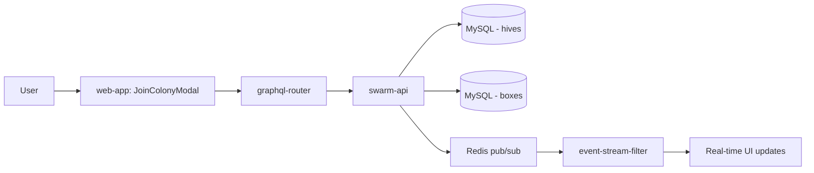

## 🫶🏻 Join Colonies (Merge Hives)

**Status**: `feature` | **Development Stage**: `stable` | **Priority**: `high`

### 🎯 Purpose
Merge two bee colonies together by combining their boxes into a single hive. This helps strengthen weak colonies, consolidate resources before winter, or manage queen genetics.

### 🎭 User Story
- As a beekeeper
- I want to merge two colonies together
- So that I can strengthen a weak colony, consolidate hives, or manage queen genetics without losing historical data

### 🚀 Key Benefits
- **Strengthen Weak Colonies**: Combine weak hive with stronger one before winter
- **Queen Management**: Choose which queen survives (or let them fight naturally)
- **Historical Preservation**: Complete merge history tracked with dates and references
- **Smart Box Movement**: Automatically handles BOTTOM and GATE boxes (they stay in source)
- **Easy Navigation**: Clickable links between merged hives
- **Visual Feedback**: Merged hives clearly marked and grayed out in apiary list

### 🐝 Beekeeping Context

Colony merging is a common practice in beekeeping, especially:
- **Before Winter**: Strengthening weak colonies improves survival rates
- **After Queen Loss**: Combining queenless colony with queenright one
- **Resource Consolidation**: Reducing colony count while preserving bees
- **Genetics Management**: Allowing preferred queen to lead combined colony

The classic method uses newspaper between boxes to slowly merge colonies, letting bees gradually accept each other's scent. Our digital tool manages the logistics while the beekeeper handles the physical merge.

### 🔧 Technical Overview

**Architecture:**



**Components:**
- **swarm-api**: Core merge logic and database operations
  - `joinHives` mutation with validation
  - Box movement and position recalculation
  - Hive status updates (`merged` status)
  - Historical relationship tracking
- **web-app**: User interface for colony joining
  - JoinColonyModal component (260 lines)
  - Two-panel hive comparison layout
  - Interactive merge type toggle
  - Real-time validation and error handling
- **Redis**: Real-time event broadcasting
  - `hive:join` event for target hive
  - `hive:merged` event for source hive

**Database Schema:**

```sql
-- Migration: 20251205130000_add_hive_merge_tracking.sql
ALTER TABLE hives
  ADD COLUMN merged_into_hive_id INT UNSIGNED NULL,
  ADD COLUMN merge_date DATETIME NULL,
  ADD COLUMN merge_type ENUM('both_queens', 'source_queen_kept', 'target_queen_kept') NULL,
  ADD INDEX idx_merged_into_hive_id (merged_into_hive_id);
```

**Merge Process:**

1. **User selects target hive** from same apiary
2. **Choose merge type**: Both queens, target queen, or source queen
3. **Box filtering**: System identifies BOTTOM and GATE boxes to keep in source
4. **Position calculation**: Gets max position in target hive
5. **Box movement**: Moves non-BOTTOM/GATE boxes to top of target
6. **Status update**: Marks source hive with `status='merged'`
7. **History recording**: Saves `merged_into_hive_id`, `merge_date`, `merge_type`
8. **Real-time events**: Broadcasts updates to connected clients

### 📋 How to Use

#### 1. Access Join Colony Feature

1. Navigate to the hive you want to merge (source hive)
2. Ensure hive is active (not collapsed or already merged)
3. Click **"Join Colony"** button at top of hive view (after "Create Inspection" and "Split Hive")
4. Join Colony modal opens

#### 2. Select Target Hive

**Modal displays:**
- **Left Panel**: Your current hive (source)
  - Hive name
  - Bee count estimate
  - Queen race
  - Queen year
- **Right Panel**: Target hive selector
  - List of available hives in same apiary
  - Bee count for each option
  - Queen details for each option

**Select target:**
1. Click on desired target hive from list
2. Target hive information appears in right panel
3. Compare both hives before proceeding

#### 3. Choose Merge Type

Click the toggle button between the two hive panels to cycle through options:

**Option 1: Both Queens (+)**
- Symbol: `+`
- Behavior: Keep both queens alive
- Outcome: Queens fight, strongest survives
- When to use: Uncertain which queen is better, let natural selection decide

**Option 2: Target Queen (→)**
- Symbol: `→`
- Behavior: Keep target queen, remove source queen
- Outcome: Target hive queen leads colony
- When to use: Target queen is younger, better producer, or preferred genetics

**Option 3: Source Queen (←)**
- Symbol: `←`
- Behavior: Keep source queen, remove target queen
- Outcome: Source hive queen leads colony
- When to use: Source queen is younger, better producer, or preferred genetics

**Description updates** as you toggle, explaining each option.

#### 4. Confirm Merge

1. Review both hive details
2. Confirm merge type selection
3. Click **"Join Colonies"** button
4. System processes merge automatically
5. Redirect to target hive view

#### 5. View Merge Results

**Source Hive (Merged):**
- Status: `merged` (non-editable)
- Display: "Merged into [Target Hive Name]" with clickable link
- Remaining boxes: BOTTOM and GATE only
- Appearance: Grayed out in apiary list
- Actions: Can only be deleted via "Remove hive" button

**Target Hive:**
- Status: Active (fully editable)
- Display: "Merged from [Source Hive Names]" with dates
- Boxes: Original boxes + moved boxes on top
- Actions: All normal operations available (Edit, Split, Join, Inspect)

### 🎨 Merge Types Explained

#### Both Queens Strategy (+)
**Natural Selection Approach**

When both queens are kept:
- Bees from both colonies gradually mix
- Queens eventually encounter each other
- Natural fight determines survivor
- Usually the stronger, younger queen wins

**Advantages:**
- No beekeeper intervention needed
- Natural selection favors better queen
- Less stress on colony

**Disadvantages:**
- Unpredictable outcome
- Risk of losing preferred queen
- May take longer to stabilize

#### Target Queen Strategy (→)
**Keep Target, Remove Source**

Before merge, beekeeper finds and removes source queen:
- Ensures target queen remains
- Source colony becomes queenless
- Queenless bees readily accept queenright colony
- Immediate unification

**Advantages:**
- Predictable outcome
- Control over genetics
- Quick acceptance
- Keep preferred queen line

**Disadvantages:**
- Requires finding and removing queen
- Manual intervention needed
- Source queen lost

#### Source Queen Strategy (←)
**Keep Source, Remove Target**

Before merge, beekeeper finds and removes target queen:
- Ensures source queen remains
- Target colony becomes queenless
- Combined colony under source queen
- Immediate unification

**Advantages:**
- Predictable outcome
- Control over genetics
- Keep newer or better queen
- Quick acceptance

**Disadvantages:**
- Requires finding and removing queen
- Manual intervention needed
- Target queen lost

### 🔄 Box Movement Logic

**Boxes That Stay in Source Hive:**
- ✋ **BOTTOM boxes**: Structural foundation, cannot move
- ✋ **GATE boxes**: Entrance hardware, stays with structure

**Boxes That Move to Target Hive:**
- ✅ **DEEP boxes**: Brood boxes move to target
- ✅ **SUPER boxes**: Honey supers move to target
- ✅ **QUEEN_EXCLUDER boxes**: Move to target
- ✅ **VENTILATION boxes**: Move to target
- ✅ **All other box types**: Move to target

**Position Management:**
- Moved boxes placed **on top** of target hive (highest positions)
- Positions automatically recalculated
- Relative order of moved boxes preserved
- Target hive box count increases

### 🔍 Post-Merge Navigation

Both hives remain viewable with complete historical data:

**Source Hive View:**
```
┌─────────────────────────────────────┐
│ Merged Hive Name                    │
│ Status: Merged                      │
│                                     │
│ ⚠️ Merged into: Target Hive ↗️      │
│ Date: December 5, 2025              │
│                                     │
│ Remaining Boxes:                    │
│ • Bottom Board                      │
│ • Entrance Gate                     │
│                                     │
│ [Remove Hive]                       │
└─────────────────────────────────────┘
```

**Target Hive View:**
```
┌─────────────────────────────────────┐
│ Target Hive Name                    │
│ Status: Active                      │
│                                     │
│ ℹ️ Merged from:                     │
│ • Source Hive A (Dec 5, 2025) ↗️    │
│ • Source Hive B (Dec 1, 2025) ↗️    │
│                                     │
│ [Create Inspection] [Split Hive]    │
│ [Join Colony] [Edit]                │
└─────────────────────────────────────┘
```

### 📊 GraphQL API

**Mutation:**
```graphql
mutation JoinHives {
  joinHives(
    sourceHiveId: "123"
    targetHiveId: "456"
    mergeType: "both_queens"
  ) {
    id
    name
    mergedFromHives {
      id
      name
      mergeDate
      mergeType
    }
  }
}
```

**Query Fields:**
```graphql
query GetHive {
  hive(id: "123") {
    id
    name
    status
    
    # If this hive was merged into another
    mergedIntoHive {
      id
      name
    }
    mergeDate
    mergeType
    
    # If other hives were merged into this one
    mergedFromHives {
      id
      name
      mergeDate
      mergeType
    }
  }
}
```

### ⚠️ Important Considerations

**Irreversible Operation:**
- ⚠️ Merge cannot be undone
- Boxes are permanently moved
- Source hive marked as merged
- Plan carefully before confirming

**Validation Rules:**
- Both hives must exist and belong to same user
- Both hives must be in same apiary
- Source hive cannot already be merged or collapsed
- Target hive must have space (box positions available)
- Merge type must be valid (one of three options)

**Physical Merge Steps:**
The digital merge in the app represents the logistics. Physical colony merge requires:
1. Choose merge method (newspaper, direct, etc.)
2. Remove or cage queen as per chosen merge type
3. Physically combine boxes as indicated in app
4. Monitor colony for acceptance (3-7 days)
5. Check for fighting or rejection signs
6. Confirm single queen after merge

### 🎯 Use Cases

**1. Strengthen Weak Colony**
- Source: Weak colony (1000 bees)
- Target: Strong colony (5000 bees)
- Merge type: Target queen (→)
- Result: 6000 bee colony with strong queen

**2. Combine Before Winter**
- Source: Small late-season split
- Target: Established colony
- Merge type: Both queens (+)
- Result: Strong overwintering colony

**3. Replace Old Queen**
- Source: Colony with new queen (2024)
- Target: Colony with old queen (2021)
- Merge type: Source queen (←)
- Result: Colony with young queen genetics

**4. Consolidate Apiaries**
- Multiple weak colonies in apiary
- Merge several into fewer strong colonies
- Keep best queens via targeted merges
- Result: Fewer, stronger colonies

### 🔗 Related Features

- **[Split Colony](./↔️%20Create%20colony%20split.md)**: Opposite operation - create new hive from existing one
- **Collapse Hive**: Mark inactive/dead colony (different from merge)
- **Delete Hive**: Permanently remove hive record
- **Inspections**: Track colony before/after merge

### 📝 Best Practices

**Before Merging:**
- ✅ Check both queens if keeping specific one
- ✅ Assess colony strength and bee populations
- ✅ Consider time of year (best in late summer/fall)
- ✅ Plan physical merge method
- ✅ Have equipment ready (newspaper, spray bottle, etc.)

**During Merge:**
- ✅ Complete digital merge in app first
- ✅ Follow physical merge procedure
- ✅ Use newspaper method for gradual acceptance
- ✅ Minimize disturbance to bees
- ✅ Close hive quickly after combining

**After Merging:**
- ✅ Monitor for 3-7 days for acceptance
- ✅ Check for single queen after merge
- ✅ Watch for fighting or rejection signs
- ✅ Assess food stores (combined colony needs more)
- ✅ Create inspection to document results
- ✅ Delete merged source hive after confirming success (optional)

### 🐛 Troubleshooting

**"No other hives available"**
- Need at least 2 hives in same apiary
- Create another hive or move hive to apiary with others

**"Invalid merge type"**
- Ensure one of three options selected
- Refresh page and try again

**"Source hive not found"**
- Hive may have been deleted
- Check hive ownership

**Boxes not moving as expected:**
- BOTTOM and GATE boxes always stay in source
- This is intended behavior
- Other boxes should move to target

**Can't find merged hive:**
- Merged hives appear grayed out in apiary list
- Use search or filter by status
- Check target hive's "Merged from" section for link

### 📚 Technical Resources

**Implementation Files:**
- Backend: `swarm-api/graph/schema.resolvers.go` (JoinHives mutation)
- Backend: `swarm-api/graph/model/hive.go` (MarkAsMerged, GetMergedFromHives)
- Backend: `swarm-api/graph/model/box.go` (MoveBoxesToHive, GetBoxesByTypeForHive)
- Frontend: `web-app/src/page/hiveEdit/JoinColonyModal.tsx`
- Frontend: `web-app/src/page/hiveEdit/JoinColonyModal.module.less`
- Migration: `swarm-api/migrations/20251205130000_add_hive_merge_tracking.sql`

**Documentation:**
- [Technical Implementation Guide](../../../docs/📱%20Web-app/Join%20Colony.md)
- [GraphQL API Reference](../../../docs/API/GraphQL.md)
- [Database Schemas](../../../docs/📱%20Web-app/🥞%20DB%20schemas/)

