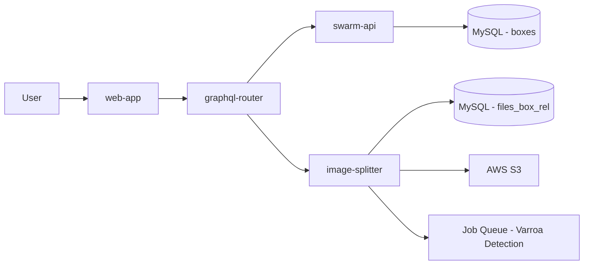

### 🎯 Purpose
Track varroa mite infestation levels by uploading and analyzing images of the hive bottom board (the white slideable panel used for varroa mite counting).

### 🎭 User Story
- As a beekeeper
- I want to upload photos of my hive bottom board
- So that I can monitor varroa mite levels over time and take action when necessary

### 🚀 Key Benefits
- **Easy Monitoring**: Simple image upload process for varroa tracking
- **Historical Tracking**: Images versioned with inspections for trend analysis
- **Automated Detection**: Images automatically queued for AI-powered varroa mite counting (coming soon)
- **Treatment Planning**: Visual evidence helps decide when treatment is needed

### 🔧 Technical Overview

The bottom board is implemented as a new box type (`BOTTOM`) in the hive structure, similar to other box types like deep boxes, supers, and entrance gates.

**Architecture:**



**Components:**
- **swarm-api**: Manages the BOTTOM box type in the database
  - GraphQL schema with BOTTOM enum value
  - Database migration for boxes table
  - Box creation and management API
- **web-app**: Provides UI for adding bottom boxes and uploading images
  - BottomBox component for image upload
  - Two-step upload process (upload → link)
  - Integration with hive structure view
- **image-splitter**: Handles image uploads, storage, and processing
  - File upload to S3
  - Database linking (`files_box_rel` table)
  - Varroa detection job queueing
  - Thumbnail generation

**Database Schema:**

```sql
-- swarm-api: boxes table
-- Box type enum includes BOTTOM
ALTER TABLE boxes CHANGE type type 
  ENUM('DEEP','SUPER','GATE','VENTILATION','QUEEN_EXCLUDER','HORIZONTAL_FEEDER','BOTTOM')
  CHARACTER SET utf8mb4 COLLATE utf8mb4_0900_ai_ci NOT NULL DEFAULT 'DEEP';

-- image-splitter: files_box_rel table
-- Links uploaded images to specific boxes
CREATE TABLE files_box_rel (
  box_id int unsigned NOT NULL,
  file_id int unsigned NOT NULL,
  user_id int unsigned NOT NULL,
  inspection_id INT NULL DEFAULT NULL,
  added_time datetime DEFAULT CURRENT_TIMESTAMP,
  INDEX (user_id, box_id, inspection_id)
) ENGINE=InnoDB DEFAULT CHARSET=utf8mb4 COLLATE=utf8mb4_bin;
```

**Image Upload Flow:**

1. **User selects image** in BottomBox component
2. **Step 1**: `uploadFrameSide` mutation uploads file to S3
   - Returns `fileId` and image URLs
   - Queues varroa detection job
3. **Step 2**: `addFileToBox` mutation links file to box
   - Creates record in `files_box_rel` table
   - Links: `box_id ↔ file_id ↔ user_id ↔ inspection_id`
4. **Storage**: Image stored in S3, metadata in MySQL

Images are stored separately from frame sides but use the same S3 infrastructure. Inspection versioning is supported through the `inspection_id` field.

### 📋 How to Use

#### 1. Adding a Bottom Board to Your Hive

1. Navigate to your hive structure view
2. Click the dropdown menu with additional box options
3. Select **"Add bottom"** button
4. The bottom board section will be added to your hive structure


#### 2. Uploading Bottom Board Images

1. Select the bottom board in your hive structure
2. Click **"Upload bottom board image"**
3. Choose a photo from your device showing the white slideable panel
4. The image will be uploaded and automatically queued for varroa detection

**Photo Tips:**
- Ensure the white slideable panel is visible and clean
- Take photos in good lighting conditions
- Include the entire bottom board in the frame
- Photos taken at the same angle help with comparison over time

#### 3. Tracking Over Time

Bottom board images are automatically versioned with inspections:
- When you create a new inspection, the current bottom board image is saved as a snapshot
- This allows you to track varroa levels over time
- Historical images remain accessible through the inspection timeline

### 🔍 What Gets Tracked

Currently:
- ✅ Bottom board image uploads
- ✅ Image storage and versioning with inspections
- ✅ Integration with hive structure management

Coming Soon:
- 🚧 Automated varroa mite counting from images
- 🚧 Varroa count displayed on image with detection regions
- 🚧 Historical charts showing varroa trends
- 🚧 Alerts when varroa exceeds treatment thresholds
- 🚧 Treatment recommendations based on mite counts

### 🏗️ Implementation Details

**Box Types Available:**
- **Deep** - Brood frames (typically 10-frame boxes)
- **Super** - Honey storage frames
- **Entrance** (formerly "Base") - Hive entrance with gates
- **Inner Lid** - Ventilation layer on top
- **Queen Excluder** - Prevents queen from moving up
- **Feeder** - Sugar syrup feeding box
- **Bottom** - ⭐ NEW - Bottom board for varroa monitoring

### 🚫 Out of Scope

- Physical bottom board hardware (this is a software feature for image tracking)
- Real-time varroa detection (images are processed asynchronously)
- Automatic treatment application (recommendations only)

### 📊 Technical Specifications

**File Support:**
- Image formats: JPEG, PNG, WebP
- Maximum file size: 30 MB
- Recommended resolution: 1920x1080 or higher

**Storage:**
- Images stored in AWS S3 at `{user_id}/{hash}/original.{ext}`
- Database records in:
  - `files` table (file metadata)
  - `files_box_rel` table (box associations)
  - `files_hive_rel` table (hive associations)
- Inspection versioning via `inspection_id` field in `files_box_rel`

**GraphQL API Endpoints:**

```graphql
# 1. Add bottom box to hive
mutation addBox($hiveId: ID!, $position: Int!, $type: BoxType!) {
  addBox(hiveId: $hiveId, position: $position, type: $type) {
    id
    type
    position
  }
}

# 2. Upload image file
mutation uploadFrameSide($file: Upload!) {
  uploadFrameSide(file: $file) {
    id
    url
    resizes {
      id
      url
      max_dimension_px
    }
  }
}

# 3. Link uploaded file to bottom box
mutation addFileToBox($boxId: ID!, $fileId: ID!, $hiveId: ID!) {
  addFileToBox(boxId: $boxId, fileId: $fileId, hiveId: $hiveId)
}
```

**Frontend Components:**
- `src/page/hiveEdit/bottomBox/BottomBox.tsx` - Main upload component
- `src/page/hiveEdit/boxes/hiveButtons.tsx` - "Add bottom" button
- `src/page/hiveEdit/index.tsx` - Integration with hive view
- `src/models/boxes.ts` - Box type definitions

**Backend Services:**
- **swarm-api** (Go):
  - `graph/schema.graphql` - GraphQL schema
  - `graph/model/box.go` - Box model
  - `migrations/20251201025115_add_bottom_box_type.sql` - Migration
- **image-splitter** (TypeScript):
  - `src/models/boxFile.ts` - Box file associations model
  - `src/graphql/resolvers.ts` - GraphQL resolvers
  - `migrations/018-box-files.sql` - Files table migration

### 🔗 Related Features
- [🔎 Inspection Management](🔎%20Inspection%20management.md) - Inspection versioning
- [📺 Video Streaming Playback](../flexible-tier/📺%20Video%20streaming%20playback.md) - Gate entrance monitoring
- Varroa Detection Model (in development)

### 📚 Resources & References
- [Bottom Board Varroa Monitoring Guide](https://honeybeehealthcoalition.org/varroa/) - Best practices
- [Tech Stack & Conventions](../../../../docs/📱 Web-app/Tech stack, conventions, environments.md)

### 💬 Implementation Notes

**Migrations Required:**

Both backend services require database migrations before the feature works:

```bash
# 1. swarm-api migration - Add BOTTOM box type
cd swarm-api
just migrate-db-dev
# Runs: migrations/20251201025115_add_bottom_box_type.sql

# 2. image-splitter migration - Create files_box_rel table
cd image-splitter
just stop && just start  # Rebuilds container and auto-runs migrations
# Runs: migrations/018-box-files.sql
```

**Deployment Steps:**

1. Deploy swarm-api with BOTTOM box type
2. Deploy image-splitter with files_box_rel table
3. Deploy web-app with BottomBox component
4. Restart graphql-router to pick up new schema

**Build Info:**
- Backend: swarm-api v1.0 (Go 1.23+)
- Image Service: image-splitter v1.0 (TypeScript/Node.js)
- Frontend: web-app v1.0 (Preact/React)
- Build size: 2.17 MB (gzipped 681 KB)

**Key Files:**
- Migrations:
  - `swarm-api/migrations/20251201025115_add_bottom_box_type.sql`
  - `image-splitter/migrations/018-box-files.sql`
- Models:
  - `swarm-api/graph/model/box.go`
  - `image-splitter/src/models/boxFile.ts`
- Components:
  - `web-app/src/page/hiveEdit/bottomBox/BottomBox.tsx`

**Testing:**

After deployment, verify:
```sql
-- Check box type enum includes BOTTOM
SHOW COLUMNS FROM boxes LIKE 'type';

-- Check files_box_rel table exists
DESCRIBE files_box_rel;

-- Test: Create bottom box and upload image
-- Verify records created:
SELECT * FROM boxes WHERE type = 'BOTTOM';
SELECT * FROM files_box_rel ORDER BY added_time DESC LIMIT 5;
```

**Known Limitations:**
- Images display not yet implemented in UI (upload works, viewing coming soon)
- Varroa detection model still in development
- Historical charts not yet available

---
**Last Updated**: December 1, 2025
**Status**: Beta - Image upload functional, AI detection in development
**Implementation**: Complete (3 services: swarm-api, web-app, image-splitter)
**Next Review**: January 2026

