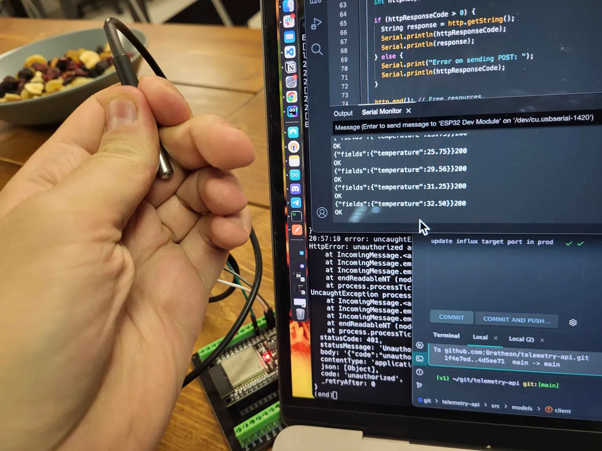
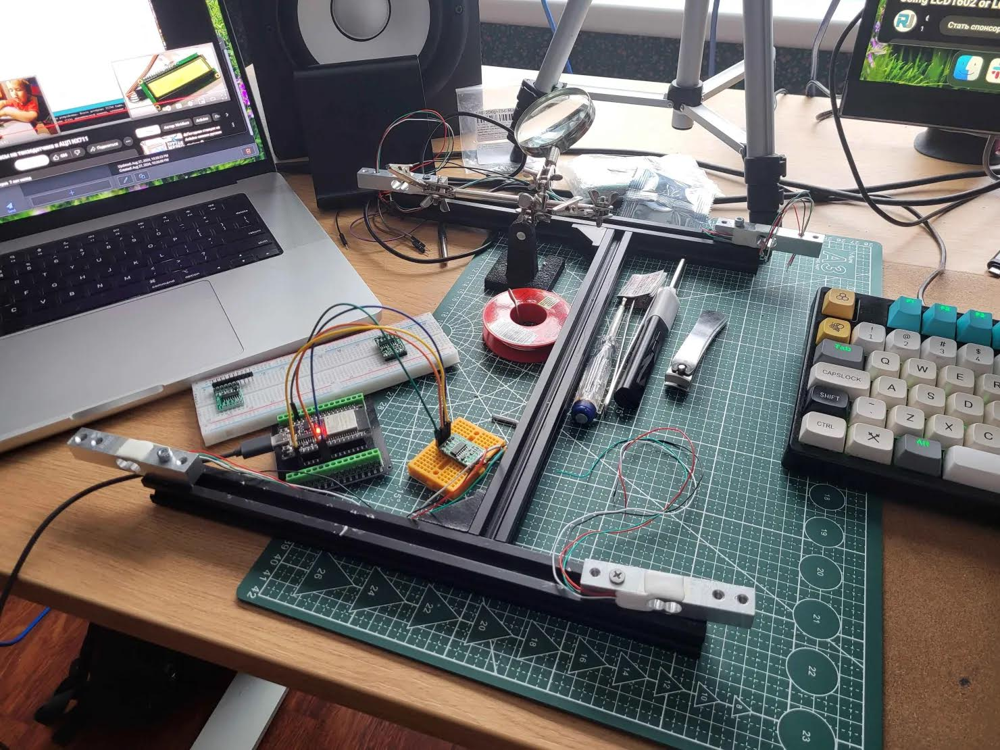

`status: proof-of-concept, 10% complete`

To compliment [👁️‍🗨️ Entrance Observer](../👁️‍🗨️%20Entrance%20Observer/👁️‍🗨️%20Entrance%20Observer.md) and [🧿 Robotic Beehive](../🧿%20Robotic%20Beehive/🧿%20Robotic%20Beehive.md) , we need a way to send Telemetry API data to the [📱Web-app](../📱Web-app/📱Web-app.md) from low-power IoT devices.

As there are lots of sensors that send read-only data, it does not make sense to bundle this logic with Robotic Beehive which should focus on controlling (moving) physical frames.

IoT sensors should be sold and thus operate separately from other products that we offer.
## Target audience
- [🧑‍🚀 Hobby beekeepers](../clients/🧑‍🚀%20Hobby%20beekeepers.md)
- [👨🏻‍🚒 Industrial beekeepers](../clients/👨🏻‍🚒%20Industrial%20beekeepers.md)
- [👩🏼‍🏫 Urban beekeepers](../clients/👩🏼‍🏫%20Urban%20beekeepers.md)

