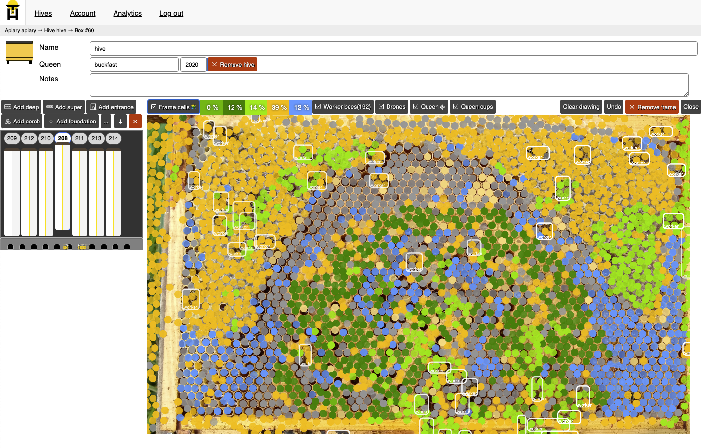

`status: minimum viable product, 60% complete`

Gratheon web-app main job is to provide data analytics about bees that beekeeper owns.
Main use-case is to add most important entities to an app and then manipulate their state as a reflection of reality. 

## Core domain entitites
Such domain entities include:

- Apiary
- Colony and Queen
- Hive
- Hive sections and entrances
- Frames
- Inspections

## Use cases

First use-case for a beekeeper is to upload frame photos and receive AI-assisted data analytics about his apiary.

Second use-case is to upload a video of hive entrance and see it as a video stream

App itself is also multilingual

