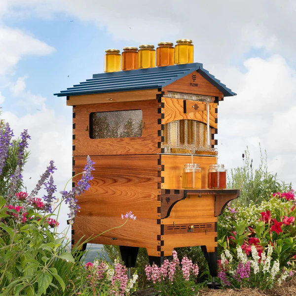
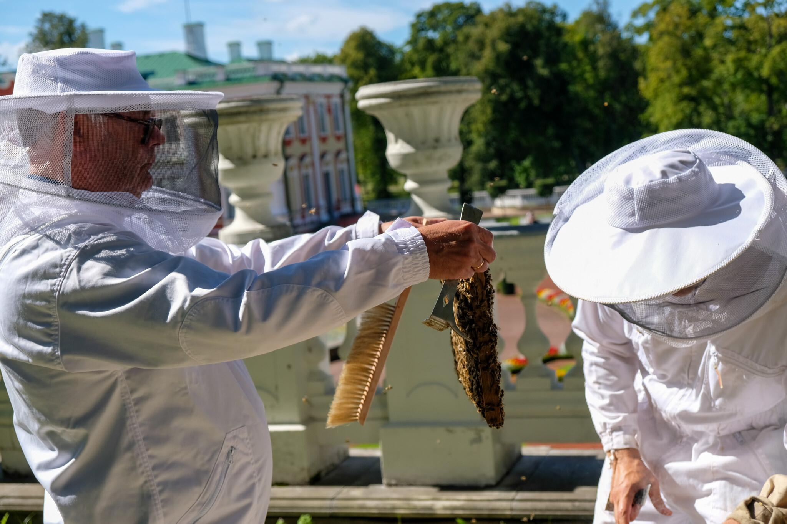

`status: proof-of-concept, 5% complete`

[Bill of Materials (robot)](https://www.notion.so/Bill-of-Materials-robot-7d3741a8e09d490e88eb285b2bbdc180?pvs=21)

## Why

To solve [**Observability of bee colony**](https://www.notion.so/Observability-of-bee-colony-c7971983f26d4ff19da0ef3390c4871b?pvs=21), [**Physical labor**](https://www.notion.so/Physical-labor-b8861af7945c4cfea61020521ec26a27?pvs=21), [Challenging to become a new beekeeper](https://www.notion.so/Challenging-to-become-a-new-beekeeper-bdf59f6539da4005a394efac02c9c949?pvs=21), [Ugly beehives](https://www.notion.so/Ugly-beehives-49a604ea99fa429691b0e23dccc1f172?pvs=21) problems, we’re building **a single-colony** robotic beehive, capable of automating inspections.

## Vision and Positioning

Single-colony robot costs too much (>2000 EUR) to be cost-efficient in large scales. Because of this, it is unlikely that [Industrial beekeepers](https://www.notion.so/Industrial-beekeepers-cf0c8af087cb456dbb72058b88a42db9?pvs=21) or [Farmers](https://www.notion.so/Farmers-df786b4ba018453da181a8d9da186a79?pvs=21) (that have >20 beehives) will buy it. Instead, we are targeting people that value exterior [Design](https://www.notion.so/Design-0fcc20f16af7447587add9b6a9799f9b?pvs=21) to compliment their brand.

[https://www.honeyflow.com/](https://www.honeyflow.com/) as example of tehnological beehive, selling for 700 EUR

President Alar Karis harvesting honey from the Kadriorg Palace beehives. ([Photo: Office of the President](https://news.err.ee/1609070024/gallery-president-alar-karis-harvesting-honey-in-front-of-kadriorg-palace#lg=1&slide=1)) An example of complimentary brand

### Clients / Target audience

- [👨🏻 Potential new beekeepers](../clients/👨🏻%20Potential%20new%20beekeepers.md) ← as a shiny and safe beehive that can also teach them beekeeping
- [👩🏼‍🏫 Urban beekeepers](../clients/👩🏼‍🏫%20Urban%20beekeepers.md) ← as a way to research how bees are behaving and avoid disturbing neighbours
- [👩🏻 Tech scale-up companies](../clients/👩🏻%20Tech%20scale-up%20companies.md) ← for office roof as a brand building hardware and a in-house honey perk

## How

Main flow is to:
- extract hive frame using [Robotics](https://www.notion.so/Robotics-1d7756ebf56e4a30ba652a128b583f82?pvs=21)
- take photos from both sides
- upload to the [Web-app](https://www.notion.so/Web-app-2937ed264e1d434a8664caa4bc40978e?pvs=21) where it will be processed for health status

## Functional requirements / features
<!-- QueryToSerialize: table WITHOUT ID "[" + default(title, file.name) + "]" + default( "("+  replace(replace(file.path, "gratheon.com/about/products/🧿 Robotic Beehive/", ""), " ", "%20") + ")", "") as title FROM "gratheon.com/about/products/🧿 Robotic Beehive/ideas" WHERE file.name != "index" -->
<!-- SerializedQuery: table WITHOUT ID "[" + default(title, file.name) + "]" + default( "("+  replace(replace(file.path, "gratheon.com/about/products/🧿 Robotic Beehive/", ""), " ", "%20") + ")", "") as title FROM "gratheon.com/about/products/🧿 Robotic Beehive/ideas" WHERE file.name != "index" -->

| title                                                                                                                                                       |
| ----------------------------------------------------------------------------------------------------------------------------------------------------------- |
| [🍭 Automatic sugar syrup feeder](ideas/🍭%20Automatic%20sugar%20syrup%20feeder.md)                                                                         |
| [🎙️ 6-channel audio monitoring](ideas/🎙️%206-channel%20audio%20monitoring.md)                                                                             |
| [🎮 Client-side app with UI in manual override mode](ideas/🎮%20Client-side%20app%20with%20UI%20in%20manual%20override%20mode.md)                           |
| [🎮 Connecting robot to web-app UX](ideas/🎮%20Connecting%20robot%20to%20web-app%20UX.md)                                                                   |
| [🐝 Bee nursing video analysis](ideas/🐝%20Bee%20nursing%20video%20analysis.md)                                                                             |
| [🐝 Bee specialization classification](ideas/🐝%20Bee%20specialization%20classification.md)                                                                 |
| [📸 Full hive inspection](ideas/📸%20Full%20hive%20inspection.md)                                                                                           |
| [📸 Real-time frame scanning](ideas/📸%20Real-time%20frame%20scanning.md)                                                                                   |
| [🔊 Audio-interface to talk to bees](ideas/🔊%20Audio-interface%20to%20talk%20to%20bees.md)                                                                 |
| [🔌 Energy autonomy](ideas/🔌%20Energy%20autonomy.md)                                                                                                       |
| [🔥 Hive heating](ideas/🔥%20Hive%20heating.md)                                                                                                             |
| [🚁 Ventilation control](ideas/🚁%20Ventilation%20control.md)                                                                                               |
| [🛑 Close mechanised hive entrance in case of robbing behaviour](ideas/🛑%20Close%20mechanised%20hive%20entrance%20in%20case%20of%20robbing%20behaviour.md) |
| [🛑 Close mechanized hive entrance in case of hornet attack](ideas/🛑%20Close%20mechanized%20hive%20entrance%20in%20case%20of%20hornet%20attack.md)         |
| [🦾 Moveable hive bottom with varroa counting](ideas/🦾%20Moveable%20hive%20bottom%20with%20varroa%20counting.md)                                           |
| [🛑 Mechanically reduce hive entrance in case of high wind](ideas/🛑%20Mechanically%20reduce%20hive%20entrance%20in%20case%20of%20high%20wind.md)           |
| [🦾 Robotic frame reordering](ideas/🦾%20Robotic%20frame%20reordering.md)                                                                                   |
| [🦾 Robotic insertion of new frames](ideas/🦾%20Robotic%20insertion%20of%20new%20frames.md)                                                                 |
| [🦾Robotic frame isolation & extraction](ideas/🦾Robotic%20frame%20isolation%20&%20extraction.md)                                                           |
| [🧪 Automatic acid treatment against varroa](ideas/🧪%20Automatic%20acid%20treatment%20against%20varroa.md)                                                 |
<!-- SerializedQuery END -->

## Non-functional requirements

Extraction should happen without disturbing the bees, exposing them to elements or risking people around.

- able to adjust to frame size and hive section size of customer’s choice (Langstroth, Farrar, National etc)
- should not harm human operator - @Regulations and Compliance (ex. breaking hands)
- not kill 🐝 bees [squashing with moving mechanisms, cause hypothermia, open to stealing or attacks via cracks]
- be able to extract frame if bees glued it with wax
- not 🔥 ignite from overheating, sun, electrical wiring etc. Beewax is highly flammable
- move frame that is full of honey (4kg)
- be repairable (modular, hot-swappable)
- be offline-first. Provide data to beekeeper without internet or cloud account
- provide manual on-site control over frame movement
- fallback to safe mode on power loss

## Prototype

Consists of actuators that can move the frame in/out, GPU, cameras. Very early stage as we’re focusing on [Web-app](https://www.notion.so/Web-app-2937ed264e1d434a8664caa4bc40978e?pvs=21) and [Entrance Observer](https://www.notion.so/Entrance-Observer-b0319799ab7744dc928c08119de4fc43?pvs=21) first.
