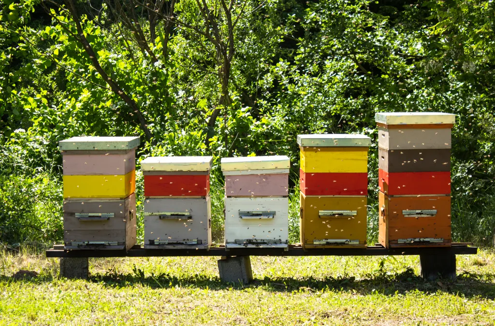

`status: idea`

As a more cost-effective solution for large apiaries, we want to reuse [R**obotic Beehive**](https://www.notion.so/Robotic-Beehive-fd9559a2950b44bc8291972299ced18e?pvs=21) functionality and equip it with ability to move around the apiary to inspect hives on-demand or on-schedule.

### Target audience

- [👨🏻‍🚒 Industrial beekeepers](../clients/👨🏻‍🚒%20Industrial%20beekeepers.md)
- [🧑🏻‍🌾 Farmers](../clients/🧑🏻‍🌾%20Farmers.md)

## Challenges / Requirements

- weather-proof hives
- bee-safe hives
- movement control across hives
- cost-efficient

# Vision

We’ll use an improvement over [R**obotic Beehive**](https://www.notion.so/Robotic-Beehive-fd9559a2950b44bc8291972299ced18e?pvs=21) but have it **movable between hives**. Design is not set yet and its up for the team to decide on the architecture

Apiary - beehives traditionally are positioned in a line Source - [https://beeswiki.com/what-is-an-apiary/](https://beeswiki.com/what-is-an-apiary/)

# Ideation

### Movement

|      | Move on rails                                                                          | Move on wheels                                                   |
| ---- | -------------------------------------------------------------------------------------- | ---------------------------------------------------------------- |
| Pros | - simple and predictable movement                                                      | - hive positions can be random                                   |
| Cons | - limited reach   - hives need to be in line   - costs more with larger apiaries | - need to stabilize the X-Y angles to have horizontal plane even |

## Construction

|      | Monolithic                                                                            | Distributed                                                                             |
| ---- | ------------------ | ------------ |
| Pros | - simple installation, maintenance, setup   - good weather protection              | - can scale in amount of hives and in their height   - cost effective   - healthy |
| Cons | - colonies can infect each other   - higher cost   - loss of existing inventory | - more complex integration, maintenance                                                 |