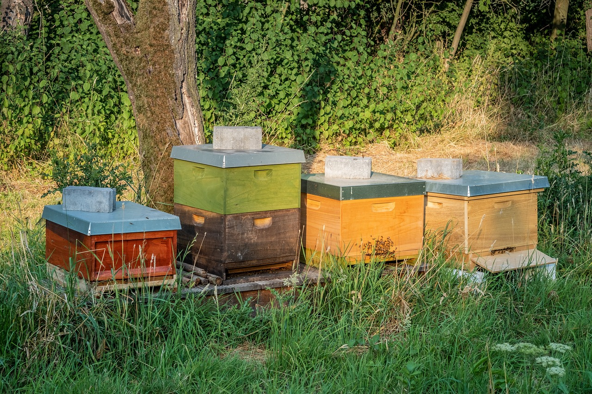

Probably the biggest problem for the beekeeper is that it is hard to make **decisions** without **up-to-date** and **correct information** about the **colony development**.  See [🧑‍🚀 Actions beekeepers make](../products/🧑‍🚀%20Actions%20beekeepers%20make.md)

And many other conscious decisions. In addition to awareness, observability needs to be done fast and sufficient:

- Timing. It is easy to miss a colony change if your inspection window is infrequent. Inspections need to be done 10 days or less to detect slight changes and trends. Bees brood, queen and swarming lifecycle is important. See for example [🐝 Frame side queen cup detection](../products/📱Web-app/community-tier/ideas%20💡/🐝%20Frame%20side%20queen%20cup%20detection.md)
- Attention. Beekeeper needs to have cohesive information about all frames as well as colony development dynamics to plan any changes. It is hard to have sufficient attention in the field

Beehives as a black box