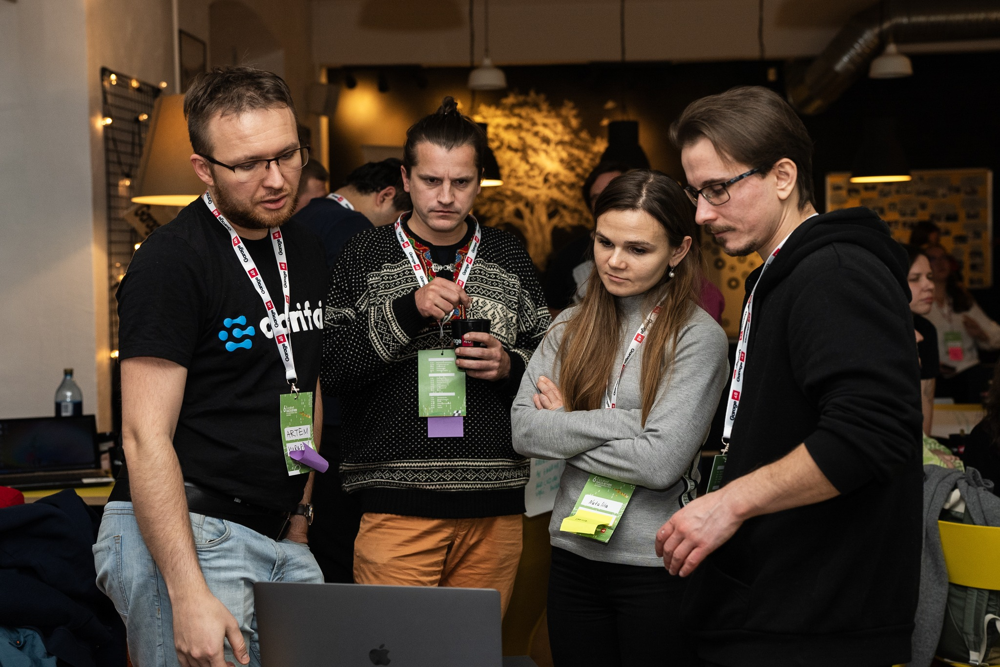

[https://garage48.org/events/6th-cassini-hackathon](https://garage48.org/events/6th-cassini-hackathon) [https://www.cassini.eu/hackathons/estonia?mtm_campaign=6CHLOEE](https://www.cassini.eu/hackathons/estonia?mtm_campaign=6CHLOEE)

Gratheon project registered: [https://taikai.network/cassinihackathons/hackathons/intdev-humaid/projects/cloewercb02zevm01kqo4xlr7/idea](https://taikai.network/cassinihackathons/hackathons/intdev-humaid/projects/cloewercb02zevm01kqo4xlr7/idea)

APIs to be used:

[https://dataspace.copernicus.eu/analyse/apis](https://dataspace.copernicus.eu/analyse/apis)

[https://www.cassini.eu/hackathons/tools](https://www.cassini.eu/hackathons/tools)

Main goal is to

- networking, growing a team
- possible feature development with geo-data
- marketing

### **6. JUDGING CRITERIA**

Both at the local level and the European level your solutions will be judged against three simple criteria.

1. **Relevance (33%) -** Does the project address one of the hackathon's three challenges? Does the project make use of Copernicus, Galileo and/or EGNOS data and signals?
2. **Innovativeness (33%) -** How innovative is the idea compared to products/services that are already on the market? Is there potential for a viable business case?
3. **Quality of the team (33%) -** Do the technical, business and creative expertise of the team members match the needs of the project?

# The Mentors

**David Clark**

Founder Tallon OÜ | Venture Partner at Tera VC I Entrepreneur & Angel Investor

**Indrek Kelder**

Mentor at Cleantech ForEst

**Ilya Bolkhovsky**

Geospatial Product Manager

**Karin Maasel**

Executive Director at Data Friendly Space

**Villem Nilbe**

Product Designer at eAgronom

**Calum Cameron**

CEO of DP Innovation Labs and Edasi Labs

**Jana Saastamoinen**

Marketing Manager at Garage48

**Romet Tagobert**

Senior Software Engineer at Twilio

**Fariha Harun**

Data Analyst/Developer at AlphaGIS

**Kristiina Lillestik**

Head of Foreign Relations in the Ministry of Regional Affairs and Agriculture

**Andres Luhamaa**

Product owner for KappaOne Sentinel-1 data layer services

**Berk Erdem**

Project Manager at ESTDEV

**Marius Taparavičius**

Lawyer at Lithuanian Red Cross society/Lietuvos Raudonojo Kryžiaus draugija

[First Gratheon Garage48 pitch to get a team.pdf](https://prod-files-secure.s3.us-west-2.amazonaws.com/6b3663fb-4bc2-4044-80e1-5d6ea956abef/a70c8f25-17ad-40cb-9721-af7dc661dc2f/Gratheon_Garage48___Cassini_pitch.pdf)

[Final Garage48 project page](https://www.notion.so/Final-Garage48-project-page-395bddc3353f45a5bae301ca13ddde28?pvs=21)

[Vocal pitch (by Aleksei)](https://www.notion.so/Vocal-pitch-by-Aleksei-94ab6405c75942408ba896194ed31d59?pvs=21)

[Project page on the web](https://www.notion.so/Share-of-beehive-inspection-public-URL-477d096f683542f4a182e53ff5f23780?pvs=21)

Product Field Map by **Ilya Bolkhovsky**