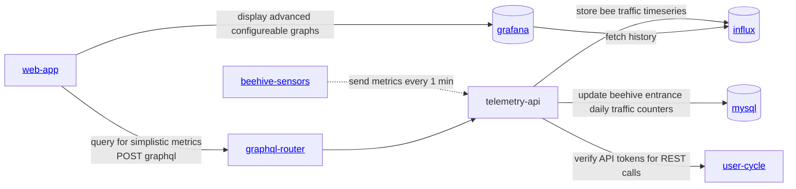
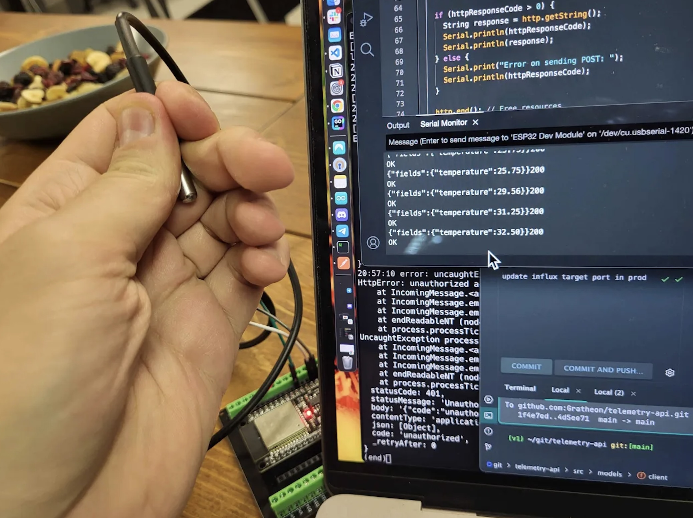

<iframe width="100%" height="400" src="https://www.youtube.com/embed/Ags3rplPkQE" title="Getting started with iot sensors development" frameborder="0" allow="accelerometer; autoplay; clipboard-write; encrypted-media; gyroscope; picture-in-picture; web-share" referrerpolicy="strict-origin-when-cross-origin" allowfullscreen></iframe>

## Architecture

### Services
- [https://github.com/Gratheon/hardware-beehive-sensors](https://github.com/Gratheon/hardware-beehive-sensors) - sensors repo on client side
- [https://github.com/gratheon/telemetry-api](https://github.com/gratheon/telemetry-api) - server side

## Dev setup

- download [Arduino IDE](https://www.arduino.cc/en/software)
- under preferences, set this URL as extra sources [https://raw.githubusercontent.com/espressif/arduino-esp32/gh-pages/package_esp32_index.json](https://raw.githubusercontent.com/espressif/arduino-esp32/gh-pages/package_esp32_index.json)
- ESP32 chips come in different flavours. If you got same component as described in the bill of materials - [ESP32](components/ESP32.md), then connect it over USB to your machine
- Choose `ESP32-WROOM-DA Module` from device list

- Make sure to change Arduino IDE upload speed to 115200 baud under Tools so that your device can receive data when you upload it

- Install [DallasTemperature@3.9.0](https://github.com/milesburton/Arduino-Temperature-Control-Library) library in Arduino IDE (DallasTemperature@3.9.0

- Install [Adafruit HX711 library](https://github.com/adafruit/Adafruit_HX711) in Arduino IDE

- Upload code to the device using a button `->`. You should see something like:
  
- Click on the reset button (`FN`) on the chip
- Connect to the ESP32 WIFI access point `gratheon`, use password `gratheon`
- Open browser and navigate to wifi access point default gateway - [http://192.168.4.1](http://192.168.4.1)
- Enter your WIFI credentials
- Set target URL `https://telemetry.gratheon.com/metric/HIVE_ID?api_token=API_TOKEN`
    - replace `HIVE_ID` with your hive ID. You can take that you can take from URL, ex `https://app.gratheon.com/apiaries/7/hives/54`; here ID is `54`
    - replace `API_TOKEN` with generate token from account settings at [https://app.gratheon.com/account](https://app.gratheon.com/account)
- Click `Save` button. Your ESP32 will restart and connect to your WIFI network and start sending data to the telemetry API service

<iframe width="100%" height="400" src="https://www.youtube.com/embed/xPlN_Tk3VLQ" title="Introduction to ESP32 - Getting Started" frameborder="0" allow="accelerometer; autoplay; clipboard-write; encrypted-media; gyroscope; picture-in-picture; web-share" referrerpolicy="strict-origin-when-cross-origin" allowfullscreen></iframe>