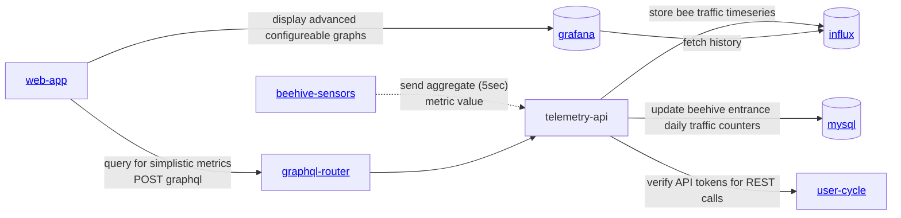

## Architecture

### Services
- [https://github.com/Gratheon/hardware-beehive-sensors](https://github.com/Gratheon/hardware-beehive-sensors) - sensors repo on client side
- [https://github.com/gratheon/telemetry-api](https://github.com/gratheon/telemetry-api) - server side

## Dev setup

- download [Arduino IDE](https://www.arduino.cc/en/software)
- under preferences, set this URL as extra sources [https://raw.githubusercontent.com/espressif/arduino-esp32/gh-pages/package_esp32_index.json](https://raw.githubusercontent.com/espressif/arduino-esp32/gh-pages/package_esp32_index.json)
- Make sure to change Arduino IDE upload speed to 115200 under Tools

<iframe width="100%" height="400" src="https://www.youtube.com/embed/xPlN_Tk3VLQ" title="Introduction to ESP32 - Getting Started" frameborder="0" allow="accelerometer; autoplay; clipboard-write; encrypted-media; gyroscope; picture-in-picture; web-share" referrerpolicy="strict-origin-when-cross-origin" allowfullscreen></iframe>