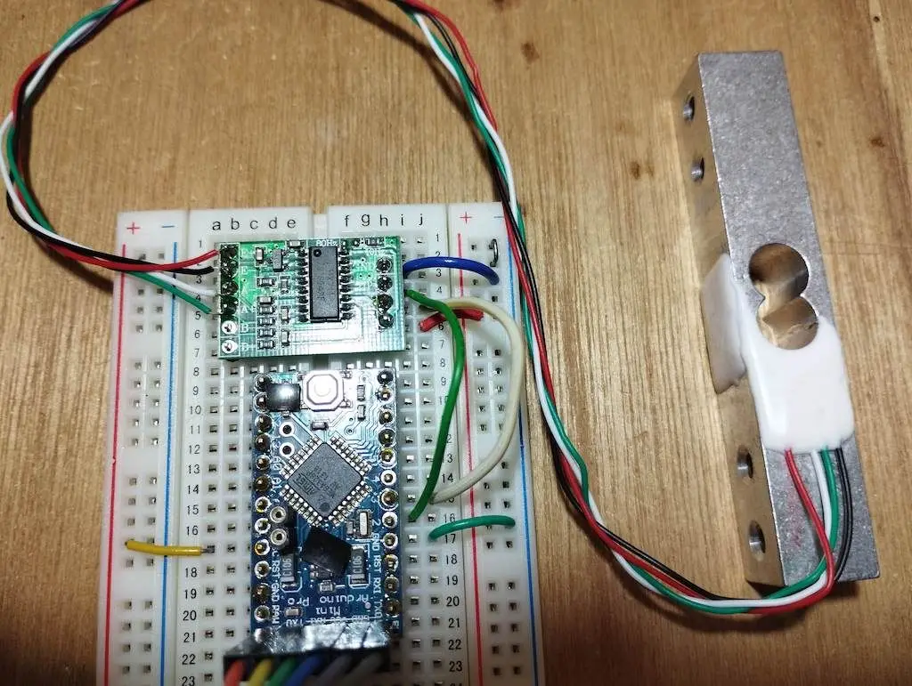
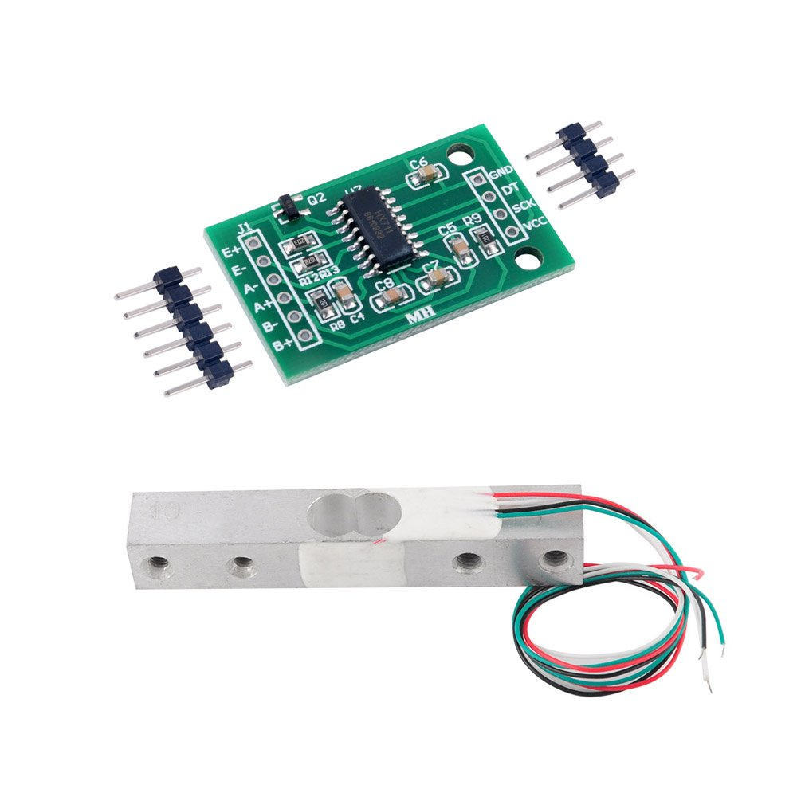

Weight sensor (HX711) 20kg * 4
https://www.aliexpress.com/item/1005006827930173.html
[https://www.amazon.de/-/en/gp/product/B079FQNJJH/](https://www.amazon.de/-/en/gp/product/B079FQNJJH/)

# Features

Two selectable differential input channels

On-chip active low noise PGA with selectable gain of 3264 and 128

On-chip power supply regulator for load-cell and ADC analog power supply

On-chip oscillator requiring no external component with optional external crystal

On-chip power-on-reset

Simple digital control and serial interface: pin-driven controlsno programming needed

Selectable 10SPS or 80SPS output data rate

Simultaneous 50 and 60Hz supply rejection

Current consumption including on-chip analog power supply regulator: normal operation < 1.5mApower down < 1uA

Operation supply voltage range: 2.6 ~ 5.5V

Operating Temperature Range:-20 degree ~ +85 degree

### Connection:

Red to E+

Black to E-

Green to A+

White to A-

<iframe width="100%" height="400" src="https://www.youtube.com/embed/AwSBbMUPjSc" title="HX711 Load Cell Arduino | HX711 calibration | Weighing Scale | Strain Gauge" frameborder="0" allow="accelerometer; autoplay; clipboard-write; encrypted-media; gyroscope; picture-in-picture; web-share" referrerpolicy="strict-origin-when-cross-origin" allowfullscreen></iframe>

## Alternative 
https://www.aliexpress.com/item/1005006593556468.html