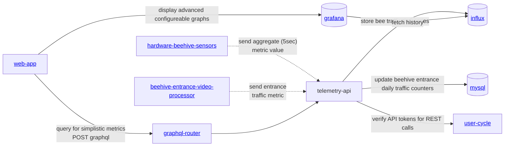

## Main code repos
- [https://github.com/gratheon/telemetry-api](https://github.com/gratheon/telemetry-api) - server side
- [https://github.com/Gratheon/hardware-beehive-sensors](https://github.com/Gratheon/hardware-beehive-sensors) - sensors repo on client side

### Choice of main CPU

| Name             |                                                        | Frequency | Networking     | Chip           | RAM   |
| ---------------- | ------------------------------------------------------ | --------- | -------------- | -------------- | ----- |
| **ESP32**        | popular, cheap, fast, simple, but may not be as stable | 160MHz    | WiFi   BT | 2xXTensa LX6   | 512KB |
| ESP8266          | relatively old                                         | 80MHz     | WiFi           |                | 160KB |
| STM32 → GD32W515 | more stable   cheaper   faster interruptions |           | -              |                | 20KB  |
| Arduino Mega     |                                                        | 16MHz     | -              | **ATmega2560** |       |
| CH32             |                                                        |           |                |                |       |
| RP2040           |                                                        |           |                |                |       |
| nRF52832         |                                                        |           |                |                |       |
| AW-CU300         |                                                        |           |                |                |       |

<iframe width="100%" height="400" src="https://www.youtube.com/embed/boF4cX338k4" title="#345 ESP32 vs STM32: Which one is better (Bluepill)?" frameborder="0" allow="accelerometer; autoplay; clipboard-write; encrypted-media; gyroscope; picture-in-picture; web-share" referrerpolicy="strict-origin-when-cross-origin" allowfullscreen></iframe>

Potential sources:

- [https://www.lcsc.com/](https://www.lcsc.com/)
- [https://8020.net/shop](https://8020.net/shop)
- [https://www.v-slot.pl/](https://www.v-slot.pl/)
- [https://www.pcbway.com/](https://www.pcbway.com/)
- [https://www.dfrobot.com/](https://www.dfrobot.com/)