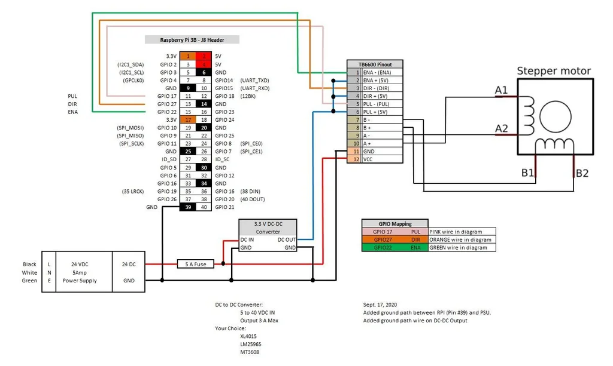

This is a list of brainstormed ideas on how to move frames to take photos to automate inspections:

## Hardware solution

We’re copy-pasting a solution by Júlia Torras Amat in the area of Biomedical Engineering Degree

- Size
    - Beehive Box external size - h 285 mm, l 450 mm ja p 506 mm.
    - Estonian Frame size - 448
    - x 279 mm
    - So we need a linear actuator with a **travel of min 500mm**
- Side positioning
- How to open/close frames to keep hive air-tight sealed?
- How do we make sure that mechanism does not rust or get polluted with organic debri?
- Which motion mechanism is better for us, planetary vs linear?

## Stepper motor driver

Stepper motor drivers are electronic devices used to control and drive stepper motors. They serve as an interface between the control system (in this case the controller) and the stepper motor, providing the necessary signals and power to accurately control its movement.

When choosing the appropriate driver for the system, it must be done according to the current that must be delivered to the stepper motor to properly function. As it can be seen in Table 7 the stepper motors incorporated in the reviewed XYZ motorized positioning systems are Nema23 and Nema24, and these specific models require 2 and 2.8 A [66], respectively. Furthermore, the stepper motor driver allows to control the number of pulses required to perform a whole turn of the stepper motor, that is, it allows to fine-tune the precision of motion of the motor. The higher the number of pulses needed to perform a revolution, the larger the precision. This will translate in the minimum number of millimeters that the positioning system can move when performing a trajectory.

## Controller
<iframe width="100%" height="400" src="https://www.youtube.com/embed/idVcItHfGS4" title="TB6600 Stepper Motor Driver with Arduino" frameborder="0" allow="accelerometer; autoplay; clipboard-write; encrypted-media; gyroscope; picture-in-picture; web-share" referrerpolicy="strict-origin-when-cross-origin" allowfullscreen></iframe>

## Relevant info
(page 38)

- [Torras_Amat_Júlia_TFG.pdf](https://prod-files-secure.s3.us-west-2.amazonaws.com/6b3663fb-4bc2-4044-80e1-5d6ea956abef/a8d93a70-2cb3-4900-8bda-b7cb55cd982d/Torras_Amat_Julia_TFG.pdf)
- [TFG-I-1682.pdf](https://prod-files-secure.s3.us-west-2.amazonaws.com/6b3663fb-4bc2-4044-80e1-5d6ea956abef/7ed8d376-7b61-40a2-b0fa-97e4940552f0/TFG-I-1682.pdf)
- [**Yahboom 6 Axis Robot Arm**](https://www.notion.so/Yahboom-6-Axis-Robot-Arm-1236c7765b2e4524a88fee8281b1bc33?pvs=21)

[PDF](img/TFG-I-1682.pdf)

[PDF](img/Torras_Amat_Júlia_TFG.pdf)

