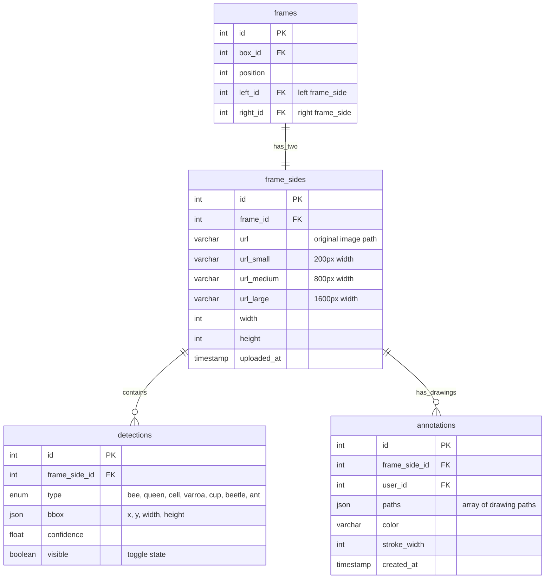
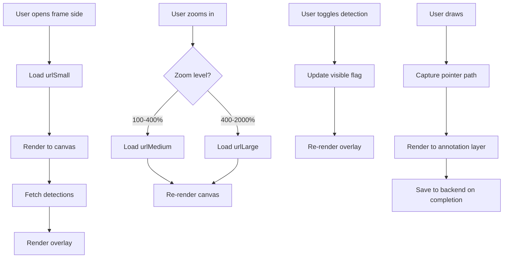

# Frame Side Management - Technical Documentation

### 🎯 Overview
Interactive frame photo viewer with zoom, pan, detection overlay toggling, and annotation capabilities. Supports progressive image loading, canvas-based drawing, and real-time detection visualization for comprehensive frame analysis.

### 🏗️ Architecture

#### Components
- **FrameSideViewer**: Main container managing photo display and interactions
- **ZoomableCanvas**: Canvas component with wheel zoom and pan support (up to 20x)
- **DetectionOverlay**: Separate canvas layer for rendering bounding boxes and annotations
- **DetectionPanel**: Sidebar with toggle controls and count display
- **DrawingToolbar**: Toolbar with pencil, undo, clear tools
- **ProgressiveImage**: Component handling multi-resolution image loading

#### Services
- **image-splitter**: Serves frame images at multiple resolutions
- **swarm-api**: Stores frame side metadata and detection data
- **web-app**: Frontend React application with canvas rendering

### 📋 Technical Specifications

#### Database Schema


#### GraphQL API
```graphql
type FrameSide {
  id: ID!
  frameId: ID!
  url: String!
  urlSmall: String
  urlMedium: String
  urlLarge: String
  width: Int!
  height: Int!
  detections: [Detection!]
  annotations: [Annotation!]
}

type Detection {
  id: ID!
  type: DetectionType!
  bbox: BoundingBox!
  confidence: Float!
  visible: Boolean!
}

enum DetectionType {
  BEE
  QUEEN
  DRONE
  CELL_BROOD
  CELL_HONEY
  CELL_POLLEN
  CELL_EMPTY
  VARROA
  QUEEN_CUP
  BEETLE
  ANT
}

type BoundingBox {
  x: Int!
  y: Int!
  width: Int!
  height: Int!
}

type Annotation {
  id: ID!
  paths: JSON!
  color: String!
  strokeWidth: Int!
  createdAt: DateTime!
}

type Query {
  frameSide(id: ID!): FrameSide!
  frameSideDetections(frameSideId: ID!, types: [DetectionType!]): [Detection!]
}

type Mutation {
  toggleDetectionVisibility(frameSideId: ID!, type: DetectionType!, visible: Boolean!): Boolean!
  saveAnnotation(frameSideId: ID!, paths: JSON!, color: String!, strokeWidth: Int!): Annotation!
  clearAnnotations(frameSideId: ID!): Boolean!
  undoLastAnnotation(frameSideId: ID!): Boolean!
}
```

### 🔧 Implementation Details

#### Frontend (web-app)
- **Framework**: React with TypeScript
- **Canvas Rendering**: HTML5 Canvas API
- **Drawing**: Pointer Events API for mouse and touch support
- **Zoom**: CSS transforms with GPU acceleration
- **Image Loading**: Progressive JPEG with blur-up effect

#### Progressive Image Loading
```
1. Initial load: 200px thumbnail (urlSmall)
2. On interaction: 800px medium (urlMedium)
3. On zoom in: 1600px large (urlLarge)
4. Lazy loading with intersection observer
```

#### Zoom Implementation
- **Level 1 (100%)**: Show urlSmall with CSS transform
- **Level 2 (100-400%)**: Load urlMedium, scale with transform
- **Level 3 (400-2000%)**: Load urlLarge, scale with transform
- **Pan**: Translate transform on drag
- **Constraints**: Prevent zoom out below 100%, zoom in above 2000%

#### Detection Overlay Rendering
```typescript
// Render loop for detection overlay
detections.forEach(detection => {
  if (detection.visible) {
    ctx.strokeStyle = getColorForType(detection.type);
    ctx.lineWidth = 2 / zoomLevel; // Maintain visual size
    ctx.strokeRect(
      detection.bbox.x * scale,
      detection.bbox.y * scale,
      detection.bbox.width * scale,
      detection.bbox.height * scale
    );
  }
});
```

#### Drawing Tool Implementation
- **Freehand Drawing**: Capture pointer move events
- **Path Storage**: Array of {x, y} coordinates
- **Undo**: Pop last path from array
- **Clear**: Empty paths array
- **Persistence**: Save paths to backend on tool deselect

#### Data Flow


### ⚙️ Configuration

**Frontend Configuration**
```typescript
const ZOOM_CONFIG = {
  min: 1.0,
  max: 20.0,
  step: 0.1,
  wheelSensitivity: 0.001,
};

const IMAGE_SIZES = {
  small: 200,
  medium: 800,
  large: 1600,
};

const DETECTION_COLORS = {
  bee: '#FFD700',
  queen: '#FF1493',
  cell: '#4169E1',
  varroa: '#FF0000',
  cup: '#FF6347',
};
```

### 🧪 Testing

#### Unit Tests
- Zoom calculations and constraints
- Detection overlay rendering logic
- Drawing path capture and storage
- Image URL selection based on zoom level
- Detection toggle state management

#### Integration Tests
- Progressive image loading sequence
- Detection data sync with backend
- Annotation persistence
- Canvas rendering performance
- Touch event handling on mobile

#### E2E Tests
- User uploads photo and views it
- User zooms in and out smoothly
- User toggles detection types on/off
- User draws annotation and undos
- User switches between frame sides

### 📊 Performance Considerations

#### Optimizations
- **Canvas Memoization**: React.memo on detection overlay
- **Render Throttling**: RequestAnimationFrame for smooth zoom
- **Image Preloading**: Prefetch next zoom level
- **Detection Batching**: Render all same-type detections in one pass
- **GPU Acceleration**: CSS transforms for zoom/pan
- **Lazy Rendering**: Only render visible detections

#### Metrics
- Initial load: under 500ms (small image)
- Zoom transition: under 100ms (60fps)
- Detection toggle: under 50ms
- Drawing responsiveness: under 16ms (60fps)
- Memory: under 100MB for large images

#### Bottlenecks
- Large images (over 4000x3000px) may impact mobile devices
- Many detections (over 1000) slow overlay rendering
- Drawing with many paths (over 100) affects undo performance

### 🚫 Technical Limitations
- No pan support yet (zoom only)
- Maximum zoom 20x (may pixelate at high zoom)
- Drawing tools limited to freehand (no shapes, text)
- No collaborative annotation (single user only)
- Annotations not versioned (overwrite on save)
- Mobile performance degraded with very large images

### 🔗 Related Documentation
- [Frame Photo Upload Technical Documentation](./frame-photo-upload.md)
- [Queen Detection Technical Documentation](./queen-detection.md)
- [Cell Detection Technical Documentation](./cell-detection.md)

### 📚 Development Resources
- [web-app FrameSideViewer component](https://github.com/Gratheon/web-app/src/components/FrameSideViewer)
- [Canvas API Documentation](https://developer.mozilla.org/en-US/docs/Web/API/Canvas_API)
- [Pointer Events API](https://developer.mozilla.org/en-US/docs/Web/API/Pointer_events)

### 💬 Technical Notes
- Consider adding pan support for better navigation at high zoom levels
- WebGL renderer may improve performance for many detections
- Consider WebP format for smaller image sizes with same quality
- Drawing tool could benefit from SVG overlay instead of Canvas for better quality
- Touch gestures (pinch zoom) would improve mobile experience
- Consider adding measurement tools (ruler, area calculator)

---
**Last Updated**: December 5, 2025
**Maintained By**: Frontend Team

