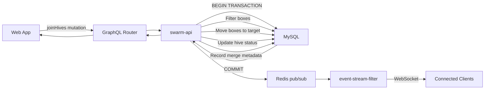

# Join Colonies - Technical Documentation

### 🎯 Overview
Join Colonies feature enables merging two bee colonies by moving boxes from source hive to target hive, with queen management options, automatic box type filtering, and complete historical tracking. Real-time event broadcasting ensures UI consistency across sessions.

### 🏗️ Architecture

#### Components
- **JoinColonyModal**: React component (260 lines) with two-panel hive comparison
- **joinHives**: GraphQL mutation with validation and atomic operations
- **event-stream-filter**: Real-time event broadcasting for UI updates

#### Services
- **swarm-api**: Core merge logic, box movement, status updates
- **web-app**: Frontend UI with interactive merge type toggle
- **Redis**: pub/sub for real-time event broadcasting
- **event-stream-filter**: WebSocket connections for live updates

#### Data Flow


### 📋 Technical Specifications

#### Database Schema
```sql
ALTER TABLE hives
  ADD COLUMN merged_into_hive_id INT UNSIGNED NULL,
  ADD COLUMN merge_date DATETIME NULL,
  ADD COLUMN merge_type ENUM('both_queens', 'source_queen_kept', 'target_queen_kept') NULL,
  ADD INDEX idx_merged_into_hive_id (merged_into_hive_id);
```

#### GraphQL API

**Mutation**
```graphql
mutation JoinHives($sourceHiveId: ID!, $targetHiveId: ID!, $mergeType: MergeType!) {
  joinHives(
    sourceHiveId: $sourceHiveId
    targetHiveId: $targetHiveId
    mergeType: $mergeType
  ) {
    id
    name
    status
    mergedIntoHiveId
    mergeDate
    mergeType
    mergedFromHives {
      id
      name
      mergeDate
      mergeType
    }
  }
}

enum MergeType {
  both_queens
  source_queen_kept
  target_queen_kept
}
```

**Query**
```graphql
query GetHive($hiveId: ID!) {
  hive(id: $hiveId) {
    id
    name
    status
    mergedIntoHive {
      id
      name
    }
    mergedFromHives {
      id
      name
      mergeDate
      mergeType
    }
  }
}
```

#### Redis Events
```
hive:join:{targetHiveId}
hive:merged:{sourceHiveId}
```

### 🔧 Implementation Details

#### Frontend
- **Framework**: React with TypeScript
- **State Management**: useState for modal state, target selection, merge type
- **UI Components**:
  - Two-panel layout (source left, target right)
  - Toggle button for merge type (cycles through 3 options)
  - Real-time validation and error handling
- **Event Handling**: WebSocket subscription for live updates

#### Backend (Go)
**Box Filtering Logic**
```go
func filterMovableBoxes(boxes []Box) []Box {
    var movableBoxes []Box
    for _, box := range boxes {
        if box.Type != "BOTTOM" && box.Type != "GATE" {
            movableBoxes = append(movableBoxes, box)
        }
    }
    return movableBoxes
}
```

**Merge Process**
1. Validate source and target hives exist
2. Validate same apiary
3. Validate source not already merged
4. Get all boxes from source hive
5. Filter boxes (exclude BOTTOM and GATE)
6. Get max position in target hive
7. Begin transaction
8. Move boxes: `UPDATE boxes SET hive_id = ?, position = ? WHERE id IN (?)`
9. Update source hive: `UPDATE hives SET status = 'merged', merged_into_hive_id = ?, merge_date = NOW(), merge_type = ? WHERE id = ?`
10. Commit transaction
11. Publish Redis events
12. Return updated target hive

#### Performance
- Database transaction ensures atomicity (all or nothing)
- Box filtering done in memory (fast operation)
- Position recalculation batched in single UPDATE
- Redis pub/sub non-blocking for mutation response
- WebSocket events delivered asynchronously

### ⚙️ Configuration
No special configuration required. Uses existing:
- MySQL connection pool
- Redis connection for pub/sub
- WebSocket server in event-stream-filter

### 🧪 Testing

#### Acceptance Criteria

**Validation**
- Cannot merge hive with itself
- Cannot merge hives from different apiaries
- Cannot merge already-merged hive
- Cannot merge into already-merged hive

**Box Movement**
- BOTTOM boxes stay in source hive
- GATE boxes stay in source hive
- All other box types move to target hive
- Moved boxes placed on top (highest positions)
- Positions recalculated sequentially
- Relative order of moved boxes preserved

**Status Updates**
- Source hive status changed to 'merged'
- Source hive merged_into_hive_id set
- Source hive merge_date recorded
- Source hive merge_type recorded
- Target hive remains 'active' status

**UI Updates**
- Source hive shows "Merged into [Target]" with link
- Target hive shows "Merged from [Source(s)]" with dates
- Source hive grayed out in apiary list
- Source hive edit buttons disabled
- Target hive fully editable

**Real-time Events**
- hive:join event published for target hive
- hive:merged event published for source hive
- Connected clients receive updates via WebSocket

#### Unit Tests
Location: `swarm-api/src/hives/hives_test.go`
- TestJoinHives_Success
- TestJoinHives_SameHive
- TestJoinHives_DifferentApiaries
- TestJoinHives_AlreadyMerged
- TestBoxFiltering_BottomAndGate

#### E2E Tests
- Full merge workflow with UI interaction
- Real-time event delivery verification
- Multi-hive merge tracking

### 📊 Performance Considerations
- Single database transaction for all operations (atomic)
- Box filtering in memory (no extra DB query)
- Bulk position update in single SQL statement
- Redis pub/sub asynchronous (non-blocking)
- WebSocket events don't block mutation response
- Efficient queries with proper indexes on foreign keys

### 🚫 Technical Limitations
- Must be in same apiary (cross-apiary not supported)
- No undo operation (requires manual split)
- No automatic queen tracking (manual intervention)
- Source hive cannot be unmerged programmatically
- BOTTOM and GATE boxes cannot be moved

### 🔗 Related Documentation
- [Split Colony Technical Documentation](./split-colony.md)
- [Hive Management](./hive-management.md)
- [Real-time Events](../Tech%20stack%2C%20conventions%2C%20environments.md)

### 📚 Development Resources
- [swarm-api Repository](https://github.com/Gratheon/swarm-api)
- [web-app Repository](https://github.com/Gratheon/web-app)
- [event-stream-filter Repository](https://github.com/Gratheon/event-stream-filter)
- [GraphQL Schema](https://github.com/Gratheon/graphql-schema-registry)

### 💬 Technical Notes
- Box type filtering critical to prevent moving structural elements
- Transaction ensures data consistency even on failure
- Redis events enable real-time UI without polling
- Source hive remains in database for historical tracking
- Multiple hives can merge into same target (tracked in array)
- Merge type enum matches beekeeping practices

---
**Last Updated**: December 5, 2025

