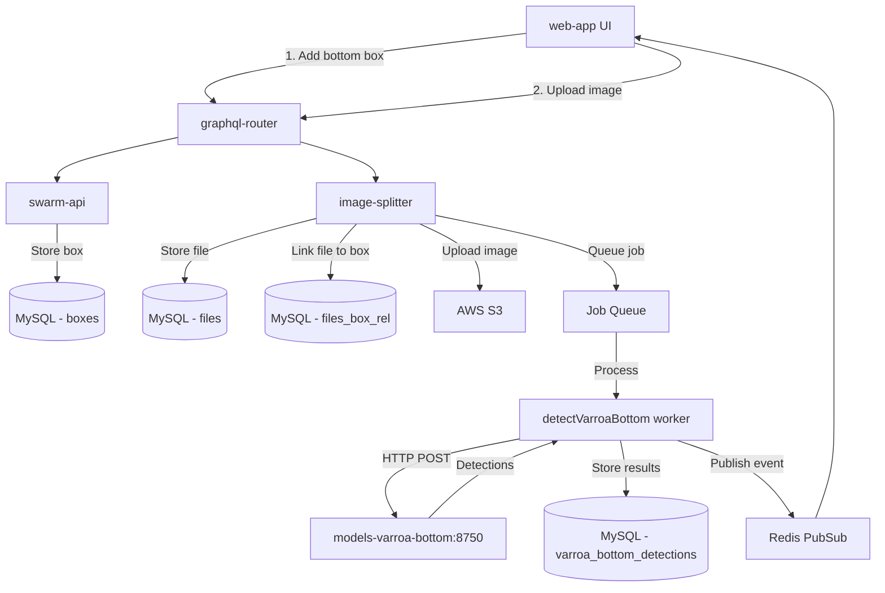

# Varroa Bottom Board Detection - Technical Documentation

### 🎯 Overview
This feature enables varroa mite detection from hive bottom board images using AI/ML models. Bottom boards (white sticky sheets placed at the hive floor) collect fallen varroa mites, which are then counted from uploaded photos. Unlike frame-based varroa detection that uses Clarifai API, bottom board detection calls a self-hosted YOLOv11 model service.

### 🏗️ Architecture

#### System Overview


#### Components

**Frontend (web-app)**
- `BottomBox.tsx` - Upload UI component
- `hiveButtons.tsx` - "Add bottom" button
- `hiveEdit/index.tsx` - Hive structure integration

**Backend Services**
- **swarm-api** (Go) - Hive structure management, BOTTOM box type
- **image-splitter** (TypeScript) - Image upload, storage, varroa detection orchestration
- **models-varroa-bottom** (Python) - YOLOv11 inference server for varroa detection
- **graphql-router** - API gateway routing GraphQL queries/mutations

**Infrastructure**
- AWS S3 - Image storage
- MySQL - Metadata and detection results
- Redis - Job queue and pub/sub for real-time updates

### 📋 Technical Specifications

#### Database Schema

**swarm-api database:**
```sql
-- boxes table stores hive structure components
CREATE TABLE `boxes` (
  `id` int unsigned NOT NULL AUTO_INCREMENT,
  `user_id` int unsigned NOT NULL,
  `hive_id` int NOT NULL,
  `active` tinyint(1) NOT NULL DEFAULT '1',
  `color` varchar(10) DEFAULT '#ffc848',
  `position` mediumint DEFAULT NULL,
  `type` enum('SUPER','DEEP','GATE','VENTILATION','QUEEN_EXCLUDER','HORIZONTAL_FEEDER','BOTTOM') 
         CHARACTER SET utf8mb4 COLLATE utf8mb4_0900_ai_ci NOT NULL DEFAULT 'DEEP',
  PRIMARY KEY (`id`),
  KEY `user_id` (`user_id`),
  KEY `hive_id` (`hive_id`)
) ENGINE=InnoDB DEFAULT CHARSET=utf8mb4 COLLATE=utf8mb4_general_ci;
```

Migration: `swarm-api/migrations/20251201025115_add_bottom_box_type.sql`

**image-splitter database:**
```sql
-- files table stores uploaded image metadata
CREATE TABLE `files` (
  `id` int unsigned NOT NULL AUTO_INCREMENT,
  `user_id` int unsigned NOT NULL,
  `hash` varchar(64) NOT NULL,
  `ext` varchar(10) DEFAULT NULL,
  `url_version` int DEFAULT 1,
  `created_at` datetime DEFAULT CURRENT_TIMESTAMP,
  PRIMARY KEY (`id`),
  UNIQUE KEY `user_file` (`user_id`, `hash`)
) ENGINE=InnoDB DEFAULT CHARSET=utf8mb4 COLLATE=utf8mb4_bin;

-- files_box_rel links images to bottom boxes
CREATE TABLE `files_box_rel` (
  `box_id` int unsigned NOT NULL,
  `file_id` int unsigned NOT NULL,
  `user_id` int unsigned NOT NULL,
  `inspection_id` INT NULL DEFAULT NULL,
  `added_time` datetime DEFAULT CURRENT_TIMESTAMP,
  INDEX (`user_id`, `box_id`, `inspection_id`)
) ENGINE=InnoDB DEFAULT CHARSET=utf8mb4 COLLATE=utf8mb4_bin;

-- varroa_bottom_detections stores AI detection results (TO BE CREATED)
CREATE TABLE `varroa_bottom_detections` (
  `id` int unsigned NOT NULL AUTO_INCREMENT,
  `file_id` int unsigned NOT NULL,
  `box_id` int unsigned NOT NULL,
  `user_id` int unsigned NOT NULL,
  `varroa_count` int NOT NULL DEFAULT 0,
  `detections` JSON NULL,
  `model_version` varchar(50) DEFAULT 'yolov11-nano',
  `processed_at` datetime DEFAULT CURRENT_TIMESTAMP,
  PRIMARY KEY (`id`),
  UNIQUE KEY `file_detection` (`file_id`),
  KEY `user_box` (`user_id`, `box_id`)
) ENGINE=InnoDB DEFAULT CHARSET=utf8mb4 COLLATE=utf8mb4_bin;
```

Migrations: 
- `image-splitter/migrations/018-box-files.sql` (existing)
- `image-splitter/migrations/XXX-varroa-bottom-detections.sql` (to be created)

**Detection JSON format:**
```json
{
  "count": 8,
  "detections": [
    {
      "x": 100.5,
      "y": 200.3,
      "width": 15.2,
      "height": 12.8,
      "confidence": 0.92
    }
  ]
}
```

#### GraphQL API

**Mutations:**
```graphql
# Add bottom box to hive structure
mutation addBox($hiveId: ID!, $position: Int!, $type: BoxType!) {
  addBox(hiveId: $hiveId, position: $position, type: $type) {
    id
    type
    position
    color
  }
}

# Upload image file (returns fileId)
mutation uploadFrameSide($file: Upload!) {
  uploadFrameSide(file: $file) {
    id
    url
    resizes {
      id
      url
      max_dimension_px
    }
  }
}

# Link uploaded file to bottom box (triggers varroa detection job)
mutation addFileToBox($boxId: ID!, $fileId: ID!, $hiveId: ID!) {
  addFileToBox(boxId: $boxId, fileId: $fileId, hiveId: $hiveId)
}

# Query varroa detection results (TO BE IMPLEMENTED)
query getVarroaBottomDetections($boxId: ID!, $inspectionId: ID) {
  varroaBottomDetections(boxId: $boxId, inspectionId: $inspectionId) {
    id
    fileId
    varroaCount
    detections {
      x
      y
      width
      height
      confidence
    }
    processedAt
  }
}
```

**Query:**
```graphql
query getBox($id: ID!) {
  box(id: $id) {
    id
    type
    position
    files {
      id
      url
      varroaDetection {
        count
        detections
      }
    }
  }
}
```

#### REST API - models-varroa-bottom

**Endpoint:** `POST /`  
**Host:** `http://models-varroa-bottom:8750`  
**Content-Type:** `multipart/form-data`

**Request:**
```bash
curl -X POST -F "file=@bottom_board.jpg" http://models-varroa-bottom:8750
```

**Response (Success):**
```json
{
  "message": "File processed successfully",
  "count": 8,
  "result": [
    {
      "x1": 2193.93,
      "y1": 1456.21,
      "x2": 2208.15,
      "y2": 1470.43,
      "confidence": 0.92
    }
  ]
}
```

**Response (No detections):**
```json
{
  "message": "No varroa mites detected",
  "result": []
}
```

**Response (Error):**
```json
{
  "message": "Error message"
}
```

### 🔧 Implementation Details

#### Current State

**Existing Frame Varroa Detection (Clarifai-based):**
- File: `image-splitter/src/workers/detectVarroa.ts`
- Uses Clarifai API for frame side images
- Splits images into 9 chunks for better detection
- Stores results in `files_frame_side_rel.detected_varroa` (JSON)
- Job type: `TYPE_VARROA`

**Existing Bottom Board Upload:**
- Bottom box type added to swarm-api
- File upload via `uploadFrameSide` mutation
- File-to-box linking via `addFileToBox` mutation
- Files stored in `files_box_rel` table
- No varroa detection currently triggered

#### Required Implementation

**1. New Worker: `detectVarroaBottom.ts`**

Location: `image-splitter/src/workers/detectVarroaBottom.ts`

```typescript
import axios from 'axios';
import config from '../config';
import { logger } from '../logger';
import { downloadS3FileToLocalTmp } from './common/downloadFile';
import boxFileModel from '../models/boxFile';
import { generateChannelName, publisher } from '../redisPubSub';

export async function detectVarroaBottom(fileId: number, payload: any) {
  const boxFile = await boxFileModel.getBoxFileByFileId(fileId);
  
  if (!boxFile) {
    throw new Error(`Box file ${fileId} not found`);
  }

  logger.info('detectVarroaBottom - processing file', { fileId, boxId: boxFile.box_id });
  
  const localPath = await downloadS3FileToLocalTmp(boxFile);
  
  const formData = new FormData();
  formData.append('file', fs.createReadStream(localPath));
  
  const response = await axios.post(
    config.models.varroaBottomUrl,
    formData,
    {
      headers: formData.getHeaders(),
      timeout: 60000
    }
  );
  
  const { count, result } = response.data;
  
  const detections = result.map(d => ({
    x: (d.x1 + d.x2) / 2,
    y: (d.y1 + d.y2) / 2,
    width: d.x2 - d.x1,
    height: d.y2 - d.y1,
    confidence: d.confidence
  }));
  
  await boxFileModel.updateVarroaDetections(
    fileId,
    boxFile.box_id,
    boxFile.user_id,
    count,
    detections
  );
  
  publisher().publish(
    generateChannelName(
      boxFile.user_id,
      'box',
      boxFile.box_id,
      'varroa_detected'
    ),
    JSON.stringify({
      fileId,
      varroaCount: count,
      detections
    })
  );
  
  logger.info('detectVarroaBottom - complete', { fileId, count });
}
```

**2. New Job Type**

Location: `image-splitter/src/models/jobs.ts`

```typescript
export const TYPE_VARROA_BOTTOM = "varroa_bottom";
```

**3. Register Worker in Orchestrator**

Location: `image-splitter/src/workers/orchestrator.ts`

```typescript
import { detectVarroaBottom } from './detectVarroaBottom';
import { TYPE_VARROA_BOTTOM } from '../models/jobs';

jobsModel.processJobInLoop(TYPE_VARROA_BOTTOM, detectVarroaBottom);
```

**4. Queue Job on Upload**

Location: `image-splitter/src/graphql/resolvers.ts`

```typescript
addFileToBox: async (_, {boxId, fileId, hiveId}, {uid}) => {
  await boxFileModel.addBoxRelation(fileId, boxId, uid);
  await fileModel.addHiveRelation(fileId, hiveId, uid);
  
  const box = await getBoxType(boxId);
  if (box.type === 'BOTTOM') {
    await jobs.addJob(TYPE_VARROA_BOTTOM, fileId);
  }
  
  return true;
}
```

**5. Configuration**

Location: `image-splitter/src/config/config.default.ts`

```typescript
export default {
  models: {
    varroaBottomUrl: process.env.VARROA_BOTTOM_URL || 'http://models-varroa-bottom:8750'
  }
}
```

**6. Database Model Extensions**

Location: `image-splitter/src/models/boxFile.ts`

```typescript
async updateVarroaDetections(
  fileId: number,
  boxId: number, 
  userId: number,
  count: number,
  detections: any[]
) {
  await storage().query(
    sql`INSERT INTO varroa_bottom_detections 
        (file_id, box_id, user_id, varroa_count, detections)
        VALUES (${fileId}, ${boxId}, ${userId}, ${count}, ${JSON.stringify(detections)})
        ON DUPLICATE KEY UPDATE
        varroa_count = VALUES(varroa_count),
        detections = VALUES(detections),
        processed_at = NOW()`
  );
}

async getVarroaDetections(boxId: number, userId: number, inspectionId: number | null = null) {
  const result = await storage().query(
    sql`SELECT vbd.* 
        FROM varroa_bottom_detections vbd
        JOIN files_box_rel fbr ON fbr.file_id = vbd.file_id
        WHERE vbd.box_id = ${boxId}
          AND vbd.user_id = ${userId}
          AND fbr.inspection_id ${inspectionId ? sql`= ${inspectionId}` : sql`IS NULL`}
        ORDER BY vbd.processed_at DESC
        LIMIT 1`
  );
  return result[0] || null;
}
```

#### Data Flow

**Upload Flow:**
1. User clicks "Upload bottom board image" in web-app
2. `uploadFrameSide` mutation uploads file to S3, returns `fileId`
3. `addFileToBox` mutation links file to bottom box
4. Job queued: `TYPE_VARROA_BOTTOM` with `fileId`
5. Worker downloads image from S3
6. Worker calls models-varroa-bottom HTTP API
7. Worker stores detections in `varroa_bottom_detections` table
8. Worker publishes Redis event with results
9. Web-app receives real-time update via subscription

**Query Flow:**
1. User opens hive bottom board view
2. GraphQL query fetches box files and associated varroa detections
3. UI displays image with overlay showing detected mites
4. Historical data shown via inspection versioning

### ⚙️ Configuration

**Environment Variables (image-splitter):**
```bash
VARROA_BOTTOM_URL=http://models-varroa-bottom:8750
```

**Docker Compose (models-varroa-bottom):**
```yaml
models-varroa-bottom:
  image: gratheon/models-varroa-bottom:latest
  ports:
    - "8750:8750"
  volumes:
    - ./models-varroa-bottom/model:/app/model
```

### 🧪 Testing

#### Manual Testing
```bash
# Test models-varroa-bottom API directly
curl -X POST -F "file=@test_bottom_board.jpg" http://localhost:8750

# Expected response with detections
{
  "message": "File processed successfully",
  "count": 5,
  "result": [...]
}
```

#### Integration Testing
```typescript
// test/varroa-bottom-detection.test.ts
describe('Varroa Bottom Detection', () => {
  it('should queue detection job when bottom box file uploaded', async () => {
    const fileId = await uploadFile('bottom_board.jpg');
    const boxId = await createBottomBox(hiveId);
    
    await addFileToBox(boxId, fileId, hiveId);
    
    const job = await jobs.fetchUnprocessed(null, TYPE_VARROA_BOTTOM);
    expect(job.ref_id).toBe(fileId);
  });
  
  it('should call models-varroa-bottom and store results', async () => {
    const detections = await detectVarroaBottom(fileId, {});
    
    const results = await boxFileModel.getVarroaDetections(boxId, userId);
    expect(results.varroa_count).toBeGreaterThan(0);
    expect(results.detections).toBeArray();
  });
});
```

### 📊 Performance Considerations

#### Optimizations
- Bottom board images typically 3-6 MB, processed in under 10 seconds
- No image chunking needed (unlike frame detection with 9 chunks)
- Single HTTP call to models-varroa-bottom reduces latency
- Results cached in database, no reprocessing on view

#### Bottlenecks
- models-varroa-bottom CPU-only inference (no GPU requirement per upstream)
- Image download from S3 (mitigated by local caching in /tmp)
- Sequential job processing (consider parallel workers if queue grows)

#### Metrics
- Detection time: under 10 seconds per image
- Accuracy: Over 90% based on upstream VarroDetector benchmarks
- False positives: Under 5% (debris may be misclassified)

### 🚫 Technical Limitations

**Current Constraints:**
- CPU-only inference (GPU support not implemented in models-varroa-bottom)
- Single model version (no A/B testing)
- No confidence threshold configuration (hardcoded in model)
- No batch processing (one image at a time)

**Known Issues:**
- Debris on bottom board may cause false positives
- Very low lighting reduces detection accuracy
- Images over 10 MB may timeout
- No model versioning or rollback capability

**Future Improvements:**
- Add GPU support for faster inference
- Implement confidence threshold UI control
- Support batch upload and processing
- Model versioning and A/B testing
- Advanced filtering (size, color validation)

### 🔗 Related Documentation

- [Bottom Board Varroa Counting (Product)](../../../about/products/web_app/starter-tier/hive_bottom_varroa_count.md) - User-facing feature description
- [Bottom Board Management](./bottom-board-management.md) - Box type implementation
- [Frame Photo Upload](./frame-photo-upload.md) - Similar file upload flow
- [Inspection Management](./frame-side-management.md) - Versioning system

### 📚 Development Resources

**Repositories:**
- [models-varroa-bottom](https://github.com/Gratheon/models-varroa-bottom) - YOLOv11 inference server
- [VarroDetector](https://github.com/jodivaso/VarroDetector) - Upstream open-source project
- [image-splitter](https://github.com/Gratheon/image-splitter) - Image processing service
- [swarm-api](https://github.com/Gratheon/swarm-api) - Hive structure API

**External References:**
- [YOLOv11 Documentation](https://docs.ultralytics.com/)
- [Varroa Detection Paper](https://theapiarist.org/ai-and-beekeeping-counting-mites/)
- [Honey Bee Health Coalition](https://honeybeehealthcoalition.org/varroa/)

### 💬 Technical Notes

**Why not use Clarifai for bottom boards?**
- Frame varroa detection uses Clarifai because it requires chunking (9 splits) for large images
- Bottom boards are simpler - single full-image detection
- models-varroa-bottom is specialized, open-source, and self-hosted (no API costs)
- Better accuracy for bottom board context vs generic frame detection

**Inspection Versioning:**
- When user creates inspection, current file associations are snapshotted with `inspection_id`
- New uploads get `inspection_id = NULL` (current state)
- Historical queries use `inspection_id` to fetch old snapshots
- Same pattern as frame side management

**Storage Costs:**
- Average bottom board image: 4 MB
- Detection metadata: under 1 KB JSON
- S3 storage cost negligible (under $0.01/month per user)
- No image resize needed for bottom boards (unlike frames with thumbnails)

---
**Last Updated**: December 17, 2025  
**Implementation Status**: Planning / Design Phase  
**Next Steps**: Create migration, implement detectVarroaBottom worker, add GraphQL resolvers

