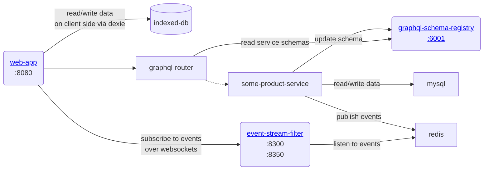
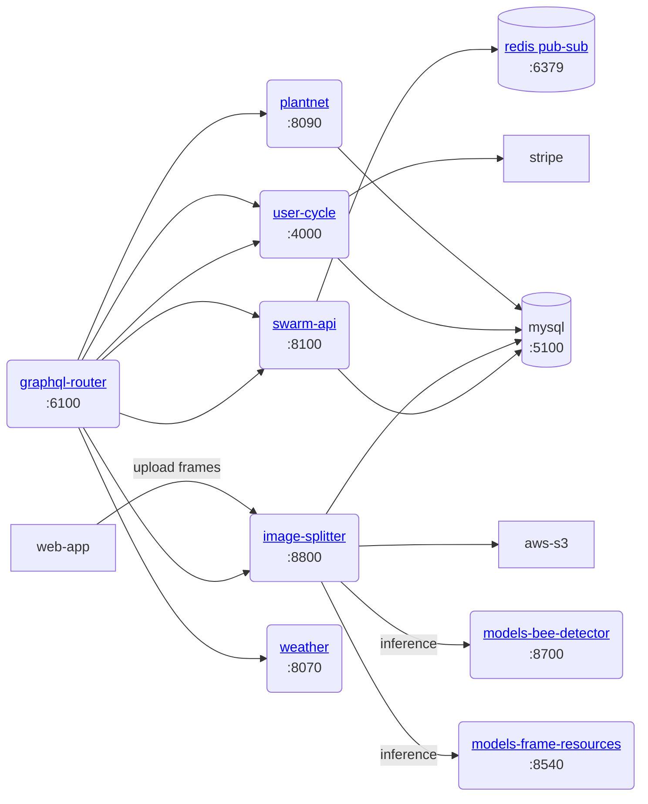
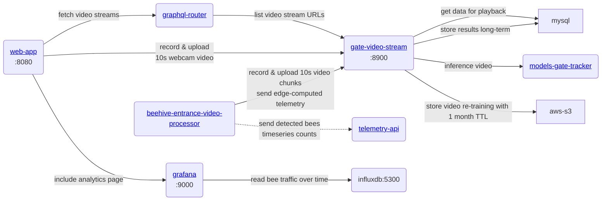

> Goal of this document is to kickstart your development of the web-app as an engineer
## Environment prerequisites

💡 You will need Linux or Mac OSX with **Docker** to develop [Web-app](https://www.notion.so/Web-app-2937ed264e1d434a8664caa4bc40978e?pvs=21) services

To develop [Entrance Observer](https://www.notion.so/Entrance-Observer-b0319799ab7744dc928c08119de4fc43?pvs=21) video processing services you’ll need [Jetson Orin Nano](https://www.notion.so/Jetson-Orin-Nano-0432edfb44f748a6874c41ddefa7f69c?pvs=21) or [Jetson Nano](https://www.notion.so/Jetson-Nano-6500eadfbab64e7b8bd0d0896df30701?pvs=21) to have GPU support and docker image compatibility

## Architecture
### Core services

The following services are mandatory, you will need to git-checkout them and start in the following order:

- mysql ← provides storage for other node and go services
- redis ← provides a pub-sub and caching layer
- graphql-schema-registry ← stores graphql schema of microservices
- graphql-router ← routes API requests to other microservices using a [graphql federation](https://www.apollographql.com/docs/federation/), which basically means that requests are split and routed to the microservice that is responsible for particular part of the schema

### Core services and routing

### Product services

- go-api ← main service that manages domain entities like apiary, hive, hive section, frame, frame side
- image-splitter ← main service that manages image processing + stores data on the detected objects in the frame photo

Note that some service may still be in development and can be unstable or only in draft phase (video processing for example)

### Video processing, playback and analytics

## Local development setup

- Start by checking out [https://github.com/gratheon/web-app](https://github.com/gratheon/web-app). Its just a react single-page app and does not need a docker image but you can see API dependencies it will require. Checkout its [README.md](http://README.md) “development” section to run it. You should be able to get to the login page, but since it doesn’t have a backend yet, you won’t be able to login
- Next, checkout all of the core dependent services based on the architecture diagram to understand how services on the backend are connected

After checkout

- For every service, you’ll need to run `make start` to start docker container
- For every service, you’ll likely need to set `src/config/config.dev.ts` that was not commited to the repository. Configs typically include credentials to access DB, AWS S3 or external services

💡 Note that some services run DB migrations when they start-up, so make sure you have mysql running and databases pre-created with valid user access. Note that most services do not yet re-connect to mysql automatically, so you need to start services in correct order or restart pod

<iframe width="100%" height="400" src="https://www.youtube.com/embed/4awyyk8sWho" title="Gratheon all-hands v1" frameborder="0" allow="accelerometer; autoplay; clipboard-write; encrypted-media; gyroscope; picture-in-picture; web-share" referrerpolicy="strict-origin-when-cross-origin" allowfullscreen></iframe>

### Optional services

Some services are not blocking the UI or backend in general, but are required for some specific features, so you may need depending on your work:

- models-bee-detector ← detects bees
- event-stream-filter ← sends events to frontend
- gate-video-stream
- models-gate-tracker

