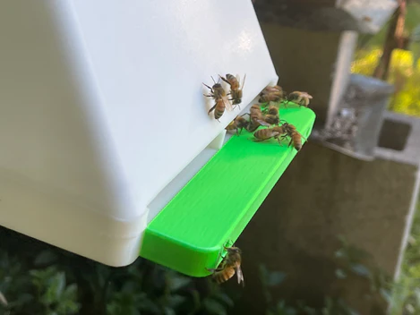

[https://blynk.io/clients/beemate-ai-powered-hives](https://blynk.io/clients/beemate-ai-powered-hives)

> uses a HD camera to count bees and run artificial intelligence software. It sends the data to our cloud platform

You can monitor your hives from anywhere using our iOS, Android or web app that allows you also to **live stream** or playback of video feed of your bees

<iframe width="433" height="244" src="https://www.youtube.com/embed/77o94J4d1Q0" title="BeeMate Background Video" frameborder="0" allow="accelerometer; autoplay; clipboard-write; encrypted-media; gyroscope; picture-in-picture; web-share" referrerpolicy="strict-origin-when-cross-origin" allowfullscreen></iframe>
