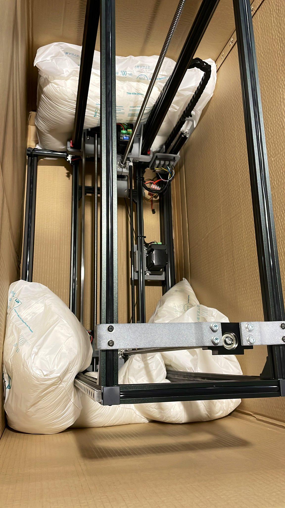
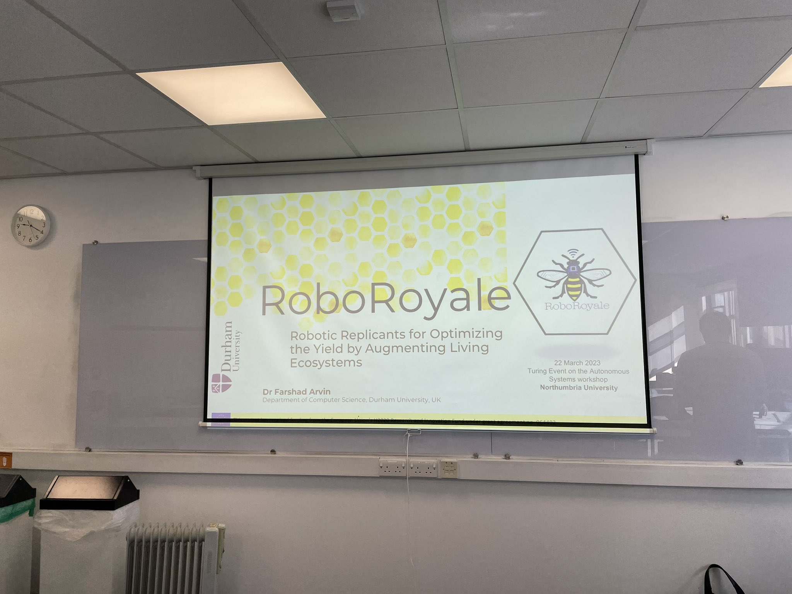
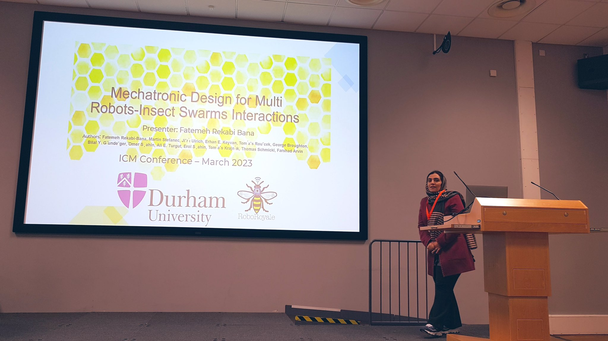
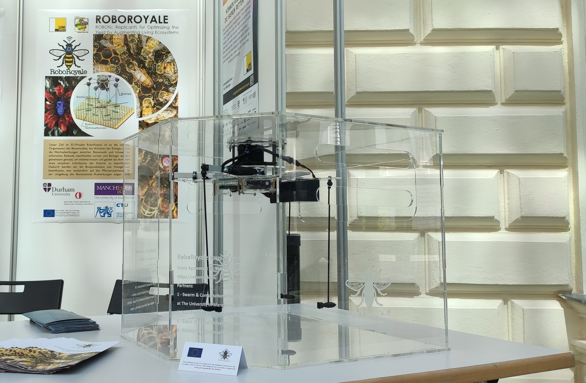

RoboRoyale project is a R&D collaboration between multiple universities to analyze queen bee behaviour using robot-driven camera and transparent (observation) beehive

- see [⭐️ Autonomous tracking of honey bee behaviors over long-term periods with cooperating robots](../papers/⭐️%20Autonomous%20tracking%20of%20honey%20bee%20behaviors%20over%20long-term%20periods%20with%20cooperating%20robots.md)
- [https://x.com/EU_RoboRoyale](https://x.com/EU_RoboRoyale)

