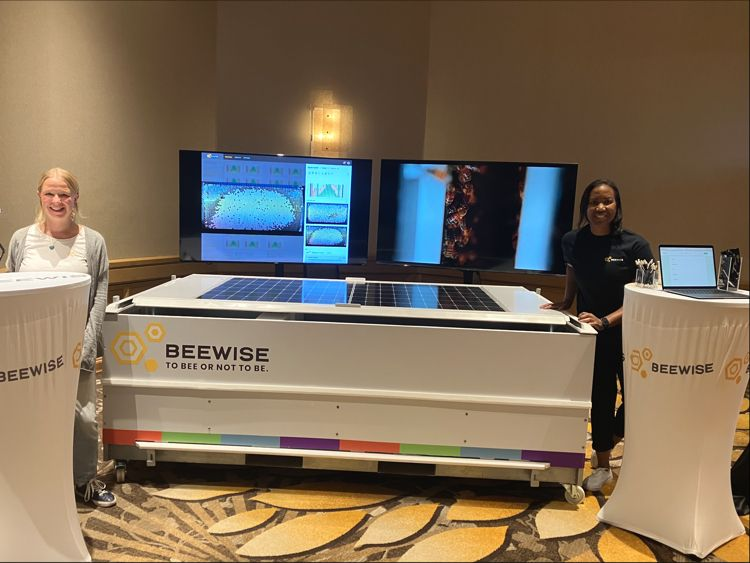
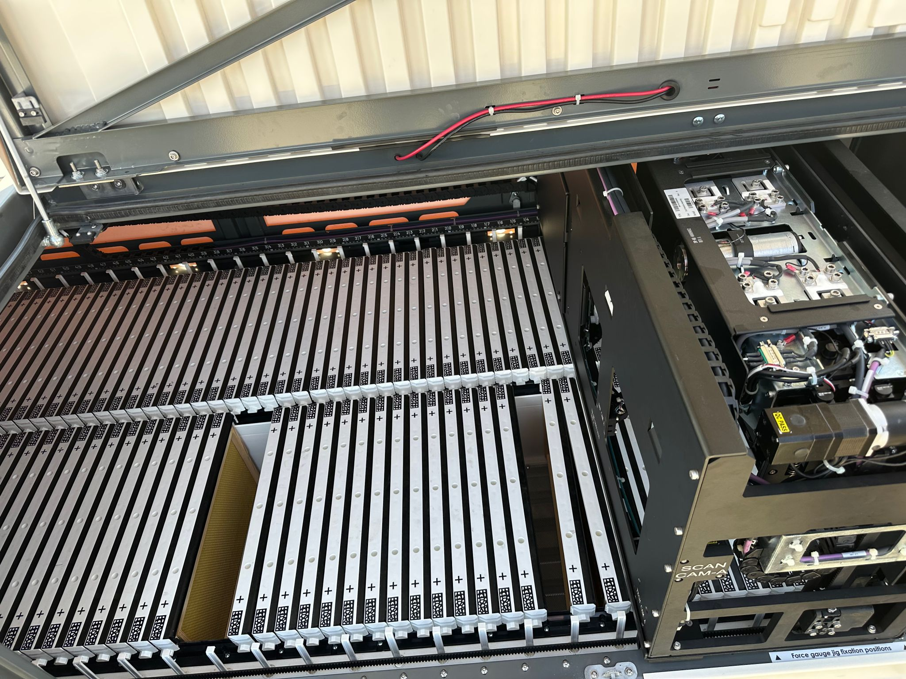
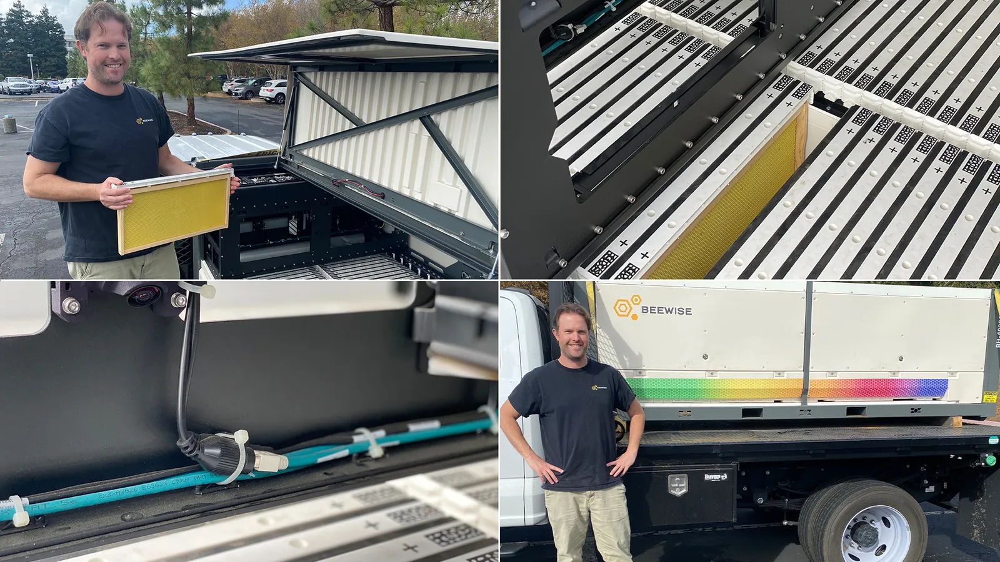

Beewise is the leading company in robotic digital beekeeping. They have iterated with multiple beehive systems, gain multiple investment rounds and operate in US.

Beewise replaces traditional hives with a monolithic container-like structure which hosts 12-28 colonies (depending on the product). The robot does automatic inspections

<iframe width="433" height="244" src="https://www.youtube.com/embed/WSvMVJpAQ6M" title="Beehome VS Beehive" frameborder="0" allow="accelerometer; autoplay; clipboard-write; encrypted-media; gyroscope; picture-in-picture; web-share" referrerpolicy="strict-origin-when-cross-origin" allowfullscreen></iframe>

