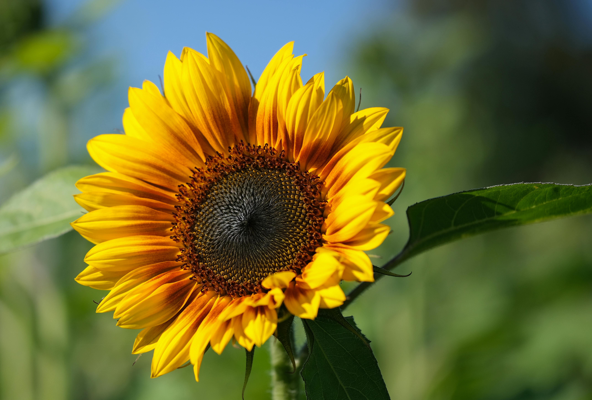

# Why

- [Company mission](Company%20mission.md)
- [Problems](../Problems.md)
# How

- [Ethics](Ethics.md)
- [Culture and values](../company/Culture%20and%20values.md)

# What we do

## For general audience

- A paragraph, for general audience
    
    
    > We help 🧑🏻‍🚀 beekeepers with 🐝 AI **observability and** 🤖 robotic **automation.** We provide a [Web-app](https://www.notion.so/Web-app-2937ed264e1d434a8664caa4bc40978e?pvs=21) and develop [Entrance Observer](https://www.notion.so/Entrance-Observer-b0319799ab7744dc928c08119de4fc43?pvs=21) and a [R**obotic Beehive**](https://www.notion.so/Robotic-Beehive-fd9559a2950b44bc8291972299ced18e?pvs=21) so that beekeepers become more **efficient** and their colonies stay **healthy**.
    > 
- Tagline + description for social networks
    
    Automating beekeeping 🐝 with AI vision and robots 🤖
    
    We help 🧑🏻‍🚀 beekeepers to model and organize their apiary 🐝 using our[Web-app](https://www.notion.so/Web-app-2937ed264e1d434a8664caa4bc40978e?pvs=21). We develop and integrate IoT devices with camera and AI vision to report vital colony metrics and alert beekeepers in case of danger. Our long-term vision is a [R**obotic Beehive**](https://www.notion.so/Robotic-Beehive-fd9559a2950b44bc8291972299ced18e?pvs=21)
    
- Call to action video (2 min)
    
    https://youtu.be/gM3AJEAhmXc
    

## For investors

- Slide deck PDF
    
    🚀 https://gratheon.com/deck.pdf
    
- One sentense for investors
    
    A data analytics app and hardware devices that helps beekeepers do less manual labour and keeps bees healthy
    
- Elevator pitch, for general investors
    
    
    <aside>
    📢 I’m a software engineer and 5 years ago I became a beekeeper to improve pollination of my garden and get higher yields. To me, bees are also a cute pet
    
    </aside>
    
    
    
    Exhausted after doing inspections
    
    > Bees are key species for our food security. Farmers are cooperating with beekeepers to combat [Insufficient pollination](https://www.notion.so/Insufficient-pollination-93d31ab6309443f9bbe0a50f4b560188?pvs=21) and increase yields
    
    But traditional beekeeping requires [**Observability of bee colony**](https://www.notion.so/Observability-of-bee-colony-c7971983f26d4ff19da0ef3390c4871b?pvs=21), because bees can experience [Colony starvation](https://www.notion.so/Colony-starvation-9925e34207b94b7e9da10e0dcfdf6e47?pvs=21) , [Colony without a queen](https://www.notion.so/Colony-without-a-queen-1bfd4efcafef44fe9383b60796c1ea3f?pvs=21), [Swarming](https://www.notion.so/Swarming-13184fe7583e452dbbc8c4e57333ef97?pvs=21),  [Infestations](https://www.notion.so/Infestations-bb89fd9dc3674f14823447875ea60324?pvs=21) and [Diseases](https://www.notion.so/Diseases-2670014b9e2b461f9021f64f1314b6b0?pvs=21) which weaken the colony and cause [Overwintering collapse](https://www.notion.so/Overwintering-collapse-2ad3d296fc3a4d8aaaed3a04ccf262b2?pvs=21) .
    
    Observability is typically solved with a [**Physical labor**](https://www.notion.so/Physical-labor-b8861af7945c4cfea61020521ec26a27?pvs=21) and [Time-consuming inspections](https://www.notion.so/Time-consuming-inspections-f9ad947403a14eedaa4393dcf4a9bcca?pvs=21). Dressed in a protective suit, in the summer heat, every week, you need to lift 20 kg beehive sections designed 150 years ago and notice small details while you are getting stung by defending bees,  [Intrusive inspections](https://www.notion.so/Intrusive-inspections-a8cd7005f8e545dbbbba82f917c01c46?pvs=21).
    
    As your apiary grows, this becomes  [Unscalable work](https://www.notion.so/Unscalable-work-edf27023ac904c1d9e8b383924df12c3?pvs=21). [Industrial beekeepers](https://www.notion.so/Industrial-beekeepers-cf0c8af087cb456dbb72058b88a42db9?pvs=21)  have [Multiple apiaries](https://www.notion.so/Multiple-apiaries-31e17bc4e98c487aa53b57b670965bc5?pvs=21) at [Distant locations](https://www.notion.so/Distant-locations-2a2e75c03b294fc9949eed71f94bfe7d?pvs=21)  that are hard to reach. Existing solutions do not adequately solve these issues
    > 
    
    ## Solution
    
    <aside>
    💡 Our solution is a beekeeping [Web-app](https://www.notion.so/Web-app-2937ed264e1d434a8664caa4bc40978e?pvs=21) software as a service working in conjunction with fully autonomous multi-hive [Robotic Apiary](https://www.notion.so/Robotic-Apiary-c14f4ea70f3146b5868a2d7874b8a958?pvs=21)  that can remotely inspect and manipulate beehives.
    
    Our primary customers are [Industrial beekeepers](https://www.notion.so/Industrial-beekeepers-cf0c8af087cb456dbb72058b88a42db9?pvs=21), they have enough money and need in robotic automation. They need large data analysis and automation to reduce manual labour. 
    
    Our secondary customers are[Backyard beekeepers](https://www.notion.so/Backyard-beekeepers-3f32d134fa11467aad7f5015288a2efe?pvs=21)  that benefit from the data analytics platform. It allows to improve organization of their apiary and plan next actions to prevent starvation, swarming,  treat pests or harvest honey. 
    
    Saving bees improves pollination efficiency, farmers get more crops, beekeepers get more money, which funds us.
    
    Join us to improve life of 100 million bee colonies worldwide.
    
    </aside>
    

- Slide deck / Pitch presentation (15 slides), for investors
    
    Inline view:
    
    https://docs.google.com/presentation/d/e/2PACX-1vRAO6JHPczQ2u8Z8ph3g7oa2UPk_0gzV-BpPC30R0AFjAL-1Bqqhrum59NEHlI7lCSbyurKZiu8-JuO/pub?start=false&loop=false&delayms=3000
    
    🚀 [Deck (docx)](https://docs.google.com/presentation/d/e/2PACX-1vRAO6JHPczQ2u8Z8ph3g7oa2UPk_0gzV-BpPC30R0AFjAL-1Bqqhrum59NEHlI7lCSbyurKZiu8-JuO/pub?start=false&loop=false&delayms=3000)
    
- Problem-solution for investors through [dealum.com](http://dealum.com)
    - Problem: Hard, frequent, unscalable work to keep bees healthy for precise pollination and food security
    - Solution: A beekeeping web-app working in conjunction with fully autonomous multi-hive robotic apiary that can remotely inspect and manipulate beehives
    - Market: Beekeepers (~2M), Industrial beekeepers, farmers

## For [Hiring](https://www.notion.so/Hiring-113571b200ec4da09f6f9785d20a136e?pvs=21)  engineers

- A paragraph
    
    
    > Gratheon is a technology company based in Tallinn, Estonia that focuses on helping beekeepers organise and automate their apiaries. We develop web application that integrates with IoT devices to provide real-time metrics for beekeeping operations. Our use of machine learning allows us to identify and alert beekeepers of potential dangers. As part of our long-term vision, we aim to automate this process with robots. Our code is open source and processes are transparent.
    >